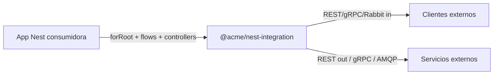

# Plan de Arquitectura — `@acme/nest-integration`

> Documento de diseño derivado de `SPEC-nest-integration.md`.
> Audiencia: implementadores del paquete. Idioma: español. APIs en inglés.
> Este plan **no reabre** las decisiones cerradas del spec (§17); las formaliza.

---

## 0. Resumen ejecutivo

Se construirá una **librería NestJS publicable** (no una app) que implementa un
subconjunto de Enterprise Integration Patterns al estilo Spring Integration:

- **Mensajería en memoria** con 4 tipos de canal (`direct`, `queue`, `pubsub`, `fanout`).
- **DSL de flows** (`from → filter → transform → … → reply`) desacoplado de clases de negocio.
- **Activators** vía decoradores (`@ServiceActivator`, `@PubSub`).
- **Inbound adapters** REST/gRPC/Rabbit declarados en controllers, con interceptor común.
  GraphQL se agrega como **cuarto transporte** (extensión sobre el spec — ADR-015).
- **Outbound adapters** REST/gRPC/Rabbit/GraphQL detrás de puertos.
- **Cross-cutting**: trazas (`AsyncLocalStorage`), idempotencia (puerto + adapter memoria),
  request/reply (`ReplyGateway`), grafo inspectable + export Mermaid.
- **Motor event-driven 100% nativo Node ≥ 18** (ver §8.5): `node:events`, `node:async_hooks`,
  `AbortSignal`, `Promise.all/allSettled` — la mensajería no añade dependencias de runtime.

**Estilo arquitectónico elegido: Hexagonal (Puertos y Adaptadores) + diseño modular por features.**
El dominio de mensajería es puro TypeScript (cero dependencias de Nest); Nest es un detalle
de infraestructura que entra solo por decoradores, DI e interceptor.

---

## 1. Contexto y alcance

| Aspecto | Decisión |
|---|---|
| Producto | Paquete npm `@acme/nest-integration` + subpath `/testing` + example app (no publicada) |
| Consumidor | Apps Nest 10/11 que importan `IntegrationModule.forRoot({ channels, idempotency }, [flows])` |
| Deps de implementación | **Prohibidas**: amqplib, `@grpc/grpc-js` en el barrel (solo optional peers tipados en adapters) |
| Peers obligatorios | `@nestjs/common`, `@nestjs/core` ^10‖^11, `@nestjs/swagger` ^7‖^8, `reflect-metadata`, `rxjs` |
| Peers opcionales | `amqplib`, `@grpc/grpc-js` (solo tipos/adapters, spec), `@nestjs/graphql` (solo decoradores GraphQL, ADR-015) |
| Fuera de scope v1 | Kafka/BullMQ, store Redis real, aggregator/splitter/resequencer, control bus, DSL XML |
| Extensión sobre el spec | Transporte GraphQL inbound/outbound — **no existe en el spec original**; se incorpora por decisión del propietario (ADR-015) |

---

## 2. Principios rectores (no negociables)

1. **El flow habla con canales, no con clases.** Los flows solo referencian `channel: string`.
   Las clases se enganchan mediante decoradores; el runtime hace el wiring.
2. **Dominio puro.** `message.ts`, contratos de canal y semántica de steps no importan Nest.
3. **Depender de abstracciones**: `MessageChannel`, `IdempotencyStore`, `AmqpLikeChannel`,
   `HeaderMapper`. Los brokers y transportes son adaptadores intercambiables.
4. **In-memory no es un broker.** Es el default de desarrollo; los brokers son puertos futuros.
5. **Precedencia de `replyChannel` explícita** en cada hop (`inherit | none | <channel>`) — ver §8.1.
6. **Errores con semántica declarada**: awaited falla el flow; forget jamás lo tumba; wireTap traga.
7. **Sin estado global oculto** fuera de `TraceContext` (que es contexto de ejecución, no estado mutable).

---

## 3. Niveles arquitectónicos (C4)

### 3.1 Nivel 1 — Sistema



### 3.2 Nivel 2 — Contenedores

| Contenedor | Descripción | Publica |
|---|---|---|
| **core lib** | Runtime de mensajería, flows, trazas, idempotencia, grafo, adapters | `@acme/nest-integration` |
| **testing lib** | Utilidades deterministas para tests de consumidores | `@acme/nest-integration/testing` |
| **example orders** | App Nest de demostración (flujo PlaceOrder + RouteByCountry corregido §17.8) | no se publica |

### 3.3 Nivel 3 — Componentes (mapa src/)

```
src/
├── message.ts                      # Dominio: contrato + helpers puros (Factory/Prototype)
├── trace/trace-context.ts          # Cross-cutting: ALS (run/current/fromHeaders/bindMessage)
├── channel.ts                      # Dominio: MessageChannel, kinds, opciones, errores de canal
├── channels/
│   ├── direct.channel.ts           # 1 subscriber; await handler; throw si vacío
│   ├── queue.channel.ts            # buffer round-robin + capacity
│   ├── pubsub.channel.ts           # broadcast + glob routingKey + grupos
│   └── fanout.channel.ts           # composite: bindings + subscribers locales
├── channel-factory.ts              # Factory registry extensible por kind  (nuevo, ver §6 OCP)
├── channel-registry.ts             # Mediator/catálogo: create/register/get/tryGet/unregister/list
├── message-dispatcher.ts           # send/sendMessage + trace bind + recordHop (SRP) (nuevo)
├── flow/
│   ├── integration-flow.ts         # Builder fluido (solo acumula steps)
│   ├── flow-step.ts                # Command: contrato de step + FlowStepContext/Outcome
│   ├── steps/*.ts                  # 1 clase por step EIP
│   └── flow-executor.ts            # Template Method: idempotencia → chain → error/reply
├── decorators.ts                   # Metadatos: @ServiceActivator/@PubSub (y tokens inbound)
├── activator/activator-wrapper.ts  # Interceptor de ejecución de activators (trace+idem+reply)
├── inbound/
│   ├── inbound.types.ts            # InboundSpec, respuestas accepted/ok/duplicate
│   ├── inbound.decorators.ts       # @InboundRest/@InboundGrpc/@InboundRabbit/@InboundGraphQL/@Inbound
│   ├── inbound.interceptor.ts      # NestInterceptor: handler→message→reply|accepted
│   ├── inbound.transport.ts        # Strategy por transporte (rest|grpc|rabbit|graphql) (nuevo)
│   ├── inbound.explorer.ts         # OnModuleInit: bindea rabbit si existe AMQP_CHANNEL
│   └── inbound.swagger.ts          # Api* helpers + setupIntegrationSwagger
├── adapters/
│   ├── header-mapper.ts            # Port + mappers por protocolo (http/grpc/amqp/graphql)
│   ├── rest.adapter.ts             # restOut.bind (fetch)
│   ├── grpc.adapter.ts             # grpcIn/grpcOut (sin importar @grpc/grpc-js)
│   ├── rabbit.adapter.ts           # AmqpLikeChannel port + in/out
│   └── graphql.adapter.ts          # graphqlIn/graphqlOut (executor inyectado, cero deps de clientes GraphQL)
├── idempotency/
│   ├── idempotency-store.ts        # Port begin/complete/fail/get/purgeExpired
│   ├── memory-idempotency.store.ts # Adapter memoria con TTL
│   └── idempotency.service.ts      # Política: scopes, acquire/release, noop path
├── gateway/reply-gateway.ts        # Facade request/reply con canal efímero
├── graph/
│   ├── channel-graph.ts            # Read-model: nodes/edges/flows/mermaid
│   └── channel-graph.controller.ts # GET /integration/graph(+/mermaid)
├── integration.module.ts           # Facade raíz: forRoot (global), orden de init §11
├── index.ts                        # Barrel público (sin amqplib/grpc!)
└── testing/index.ts                # Subpath público de testing
```

> **Nota**: `channel-factory.ts` y `message-dispatcher.ts` no están en la estructura del spec,
> pero se introducen por SRP/OCP. `ChannelRegistry` conserva la API pública exigida
> (`send`, `sendMessage`) y **delega** internamente en `MessageDispatcher`.

### 3.4 Nivel 4 — Contratos clave (código)

```ts
// ---------- Dominio puro ----------
interface IntegrationMessage<T = unknown> { payload: T; headers: MessageHeaders; }

function nextHop(
  msg: IntegrationMessage,
  hop: { channel: string; component?: string; adapter?: string },
  opts: { reply?: 'inherit' | 'none' | string },   // default 'inherit', steps SIEMPRE explícitos
): IntegrationMessage;

// ---------- Puertos ----------
interface MessageChannel {
  readonly name: string; readonly kind: ChannelKind;
  send(msg: IntegrationMessage): Promise<void>;
  subscribe(handler: MessageHandlerFn, options?: SubscribeOptions): Unsubscribe;
}

interface IdempotencyStore {
  begin(scope: string, key: string, ttlMs: number): Promise<boolean>;
  complete(scope: string, key: string, result: Record<string, unknown>): Promise<void>;
  fail(scope: string, key: string, error: unknown): Promise<void>;
  get(scope: string, key: string): Promise<Record<string, unknown> | undefined>;
  purgeExpired(): Promise<number>;
}

interface AmqpLikeChannel {           // ISP: solo lo que el adapter usa
  assertQueue(q: string, opts?: unknown): Promise<unknown>;
  consume(q: string, cb: (m: unknown) => void): Promise<unknown>;
  ack(m: unknown): void; nack(m: unknown, all: boolean, requeue: boolean): void;
  sendToQueue(q: string, body: Buffer, opts?: unknown): boolean;
  publish?(ex: string, rk: string, body: Buffer, opts?: unknown): boolean;
}

// ---------- Flow: Command + Chain ----------
type FlowStepKind =
  | 'filter' | 'transform' | 'handle' | 'wireTap' | 'fanout' | 'jump'
  | 'publish' | 'route' | 'to' | 'reply' | 'inspect';

interface FlowStepContext {
  msg: IntegrationMessage;
  registry: ChannelRegistry;          // puerto de salida (Mediator)
  trace: TraceContext;
  errorChannel: string;
  flowName: string;
}

type StepOutcome =
  | { action: 'continue'; msg: IntegrationMessage }
  | { action: 'stop'; reason: 'filtered' | 'terminated' }
  | { action: 'fail'; error: unknown };

interface FlowStep {
  readonly kind: FlowStepKind;
  describe(): Record<string, unknown>;        // alimenta inspect() y el grafo
  execute(ctx: FlowStepContext): Promise<StepOutcome>;
}

// FlowExecutor = Template Method
// execute(): acquire idem(flow:<name>) → TraceContext.run → chain de steps
//            → succeed | fail→errorChannel | duplicate→silencio
```

---

## 4. Estilo arquitectónico: Hexagonal + modular

### 4.1 Capas y reglas de dependencia (dirección única)

```
interface (decorators, interceptor, controller, module, testing)
        ↓
application (flow-executor, activator-wrapper, registry+dispatcher, gateway, idempotency.service, graph)
        ↓
domain   (message, channel, flow-step contracts, errores de dominio)   ← cero imports externos

infrastructure (channels in-memory, memory store, rest/grpc/rabbit adapters, header-mappers)
        ↳ implementa puertos del dominio/aplicación; optional peers SOLO aquí
```

Reglas duras:

- `domain/**` no importa `@nestjs/*`, rxjs, amqplib, grpc — nada.
- `application/**` solo importa `domain` y abstracciones propias.
- El barrel `index.ts` jamás importa (ni transitivamente) `amqplib` o `@grpc/grpc-js`.
- Los decoradores son el **único** punto que toca APIs de metadata de Nest.

### 4.2 Enforcement con tooling (no confianza)

- `dependency-cruiser` (o `eslint-plugin-boundaries`):
  - regla 1: `domain` sin deps externas;
  - regla 2: barrel sin `amqplib|@grpc/grpc-js`;
  - regla 3: `testing` no importa de `inbound|adapters` internos que arrastren Nest/swagger.
- `tsconfig` `strict: true`, `noUncheckedIndexedAccess`, `exactOptionalPropertyTypes`.
- Build `tsup` ESM+CJS + `exports` map en `package.json` (raíz y `./testing`).

---

## 5. Diseño OOP

### 5.1 Abstracciones núcleo

| Abstracción | Tipo | Implementaciones v1 |
|---|---|---|
| `MessageChannel` | interface (puerto) | `DirectChannel`, `QueueChannel`, `PubSubChannel`, `FanoutChannel` |
| `IdempotencyStore` | interface (puerto) | `MemoryIdempotencyStore`, `NoopIdempotencyStore` (Null Object) |
| `FlowStep` | interface (Command) | 10 clases de step |
| `HeaderMapper<P>` | interface genérica | `HttpHeaderMapper`, `GrpcHeaderMapper`, `AmqpHeaderMapper`, `GraphQLHeaderMapper` |
| `ChannelFactory` | interface + registry | factories por kind (map extensible) |
| `InboundTransportStrategy` | interface | `RestStrategy`, `GrpcStrategy`, `RabbitStrategy`, `GraphQLStrategy` |

### 5.2 Composición sobre herencia

- Los canales **no** comparten una superclase común con comportamiento; comparten contrato.
- `FanoutChannel` **compone** referencias a otros canales (Composite), no hereda de ellos.
- Los steps son objetos pequeños con colaboración inyectada (`FlowDeps`), no jerarquías profundas.
- Excepción aceptable: una base abstracta `AbstractChannel` que resuelva `name/kind` y guardas de
  subscripción **solo si** elimina duplicación real (evaluar en fase 2; preferir composición primero).

### 5.3 Inmutabilidad y contrato de mensaje

- `createMessage` produce headers completos; `nextHop`/`copyMessage` **nunca mutan** el mensaje
  de entrada: devuelven copias (Prototype) con `history` nuevo (array nuevo).
- Los steps reciben `ctx.msg` y producen `StepOutcome`; el executor mantiene el `let msg`
  del pipeline (threading §6.1) — un solo dueño del estado por invocación.

---

## 6. SOLID aplicado (decisión por decisión)

### S — Single Responsibility

| Componente | Responsabilidad única |
|---|---|
| `message.ts` | forma del mensaje + helpers puros (factory/prototype). Sin I/O |
| `channels/*` | semántica de entrega de UN kind |
| `channel-factory` | instanciar canales por spec |
| `channel-registry` | catálogo/registro y resolución de nombres (Mediator) |
| `message-dispatcher` | envío: create/nextHop + trace bind + recordHop + dispatch |
| `flow-executor` | orquestar steps + envelope idempotencia/error |
| `steps/*` | UN patrón EIP por clase |
| `activator-wrapper` | trace + idempotencia + reply del activator |
| `inbound.interceptor` | traducir request HTTP/gRPC → mensaje → respuesta |
| `inbound.explorer` | binding Rabbit en init |
| `reply-gateway` | correlación request/reply con canal efímero |
| `idempotency.service` | política (scopes, acquire/release) — **no** almacenamiento |
| `channel-graph` | read-model de topología — sin lógica de runtime |

### O — Open/Closed

| Punto de extensión | Mecanismo |
|---|---|
| Nuevo kind de canal | nuevo `ChannelFactory` registrado en el map — el registry no cambia |
| Nuevo backend de idempotencia | nueva implementación de `IdempotencyStore` inyectada en `forRoot` |
| Nuevo transporte inbound | nueva `InboundTransportStrategy` en el map de transporte |
| Nuevo header de protocolo | nuevo `HeaderMapper` registrado |
| Nuevo step de flow | nueva clase `FlowStep`; executor y builder se extienden por composición |

### L — Liskov

- Todo `MessageChannel` cumple: `send` resuelve cuando el mensaje fue **aceptado**;
  `subscribe` devuelve `Unsubscribe` idempotente. Las diferencias (throw sin subscriber en direct,
  buffering en queue) son **precondiciones documentadas del contrato**, no violaciones.
- `NoopIdempotencyStore` y `MemoryIdempotencyStore` son sustituibles sin cambios en el service.
- Los mappers de headers son intercambiables por protocolo con el mismo contrato `mapIn/mapOut`.

### I — Interface Segregation

- `AmqpLikeChannel` expone 6 métodos, no la superficie completa de amqplib.
- `FlowStep.describe()` separa la capacidad *introspectable* de la *ejecutable*.
- El consumidor de la lib depende de tokens pequeños: `ChannelRegistry` (enviar),
  `ReplyGateway` (request/reply), `ChannelGraph` (observar) — no de un god-object.

### D — Dependency Inversion

- Flows y activators dependen de `ChannelRegistry`/`TraceContext` (abstracciones), nunca de
  canales concretos ni de clases de negocio (decisión cerrada §17.1).
- `RabbitAdapter` depende del puerto `AmqpLikeChannel` resuelto por token opcional `AMQP_CHANNEL`;
  su ausencia degrada a warn (nunca crash de bootstrap).
- `IdempotencyService` recibe su store por constructor (DI Nest), default memoria.

---

## 7. GoF aplicado (patrón → dónde → por qué)

### 7.1 Creacionales

| # | Patrón | Dónde | Justificación |
|---|---|---|---|
| 1 | **Builder** | `IntegrationFlow` (DSL fluido) | acumula steps inmutables; `build()` valida y congela |
| 2 | **Factory Method / Abstract Factory** | `ChannelFactoryRegistry` (map kind→factory), `createMessage` | extensión de kinds sin modificar registry; creación uniforme de mensajes |
| 3 | **Prototype** | `copyMessage` (wireTap), `nextHop` | clonado controlado de mensaje/headers con variaciones (ids, history) |
| 4 | **Singleton** | providers del módulo `global:true` (Registry, Trace, Gateway, Graph) | un runtime por proceso Nest |

### 7.2 Estructurales

| # | Patrón | Dónde | Justificación |
|---|---|---|---|
| 5 | **Adapter** | `rest/grpc/rabbit.adapter`, `header-mapper`, `AmqpLikeChannel` | traducir protocolos ↔ `IntegrationMessage` |
| 6 | **Facade** | `IntegrationModule.forRoot`, `ChannelRegistry.send/sendMessage`, `ReplyGateway`, `setupIntegrationSwagger` | API mínima sobre subsistemas |
| 7 | **Composite** | `FanoutChannel` (bindings + subscribers), `fanoutTo/jumpTo` paralelos | dispatch recursivo a un árbol de destinos |
| 8 | **Decorator** | `InboundInterceptor` (decora handler), wireTap (decora send), wrappers trace/idem sobre activators | añadir conducta transversal sin alterar el sujeto |
| 9 | **Proxy** | canales efímeros `reply.<uuid>`, resolución lazy en registry, guarda 1-subscriber en Direct | control de acceso/ciclo de vida sobre canales reales |
| 10 | **Bridge** | `InboundSpec.transport` + strategies ↔ pipeline de canales | el pipeline ignora el transporte de origen |

### 7.3 Comportamiento

| # | Patrón | Dónde | Justificación |
|---|---|---|---|
| 11 | **Strategy** | predicados `filter/route`, `IdempotencyStore`, glob matcher de pubsub, mappers | algoritmos intercambiables en caliente (config) |
| 12 | **Observer** | `channel.subscribe`; `PubSubChannel` broadcast + grupos | desacople productor/consumidores con filtrado routingKey |
| 13 | **Command** | cada step = `FlowStep` con `execute/describe` | inspección (inspect/graph), orden determinista, testabilidad |
| 14 | **Chain of Responsibility** | `FlowExecutor` encadena steps; `filter` corta la cadena | pipeline EIP natural con short-circuit |
| 15 | **Template Method** | `FlowExecutor.execute` y `activator-wrapper` | esqueleto fijo (idem→trace→ejecutar→success/fail) con hooks inyectados |
| 16 | **Mediator** | `ChannelRegistry` | flows/activators solo conocen canales; el registry media el wiring |
| 17 | **State** | ciclo idempotencia: in-flight→completed/failed→expired | máquina explícita con TTL y duplicados |
| 18 | **Memento** | `headers.history`, `ChannelGraph.snapshot()`, `inspect()` | captura de estado para observabilidad sin exponer internals |
| 19 | **Iterator** | iteración de steps/subscribers/bindings | recorrido uniforme sin exponer colecciones |
| 20 | **Null Object** | `NoopIdempotencyStore` (enabled:false), reply sin `replyChannel` | eliminar ramas `if (enabled)` en runtime |

### 7.4 POSA y otros (no GoF-23)

| Patrón | Dónde |
|---|---|
| Dependency Injection | todo el wiring por Nest DI + tokens (`AMQP_CHANNEL`, `INTEGRATION_OPTIONS`) |
| Event Aggregator | `error.channel` (pubsub) como punto central de fallos |
| Interpreter (ligero) | glob matcher `*`/`#` de routing keys; DSL de flows interpretado por el executor |
| Ambient Context | `TraceContext` vía `AsyncLocalStorage` (propagación sin parameter drilling) |

---

## 8. Contratos críticos del runtime

### 8.0 Matriz de soporte de transportes

| Protocolo | Inbound | Outbound | Origen |
|---|---|---|---|
| REST | `@InboundRest` + `InboundInterceptor` + Swagger + `requestReply` | `restOut.bind(channel, { url, method? })` — fetch JSON; `!ok` → throw | spec §7/§9 |
| gRPC | `@InboundGrpc` (decorator) **y** programático `grpcIn.handleInbound(channel, data, metadata, requestReply?)` | `grpcOut.bind(fromChannel, stubFn, replyChannel?)` — stub inyectado, **cero imports** de `@grpc/grpc-js` | spec §7/§9 |
| Rabbit | `@InboundRabbit` = metadata; binding real en `InboundExplorer` (onModuleInit) **solo si existe `AMQP_CHANNEL`**; si no → warn, no throw | outbound queue/exchange+routingKey, persistent, headers de traza — vía puerto `AmqpLikeChannel` | spec §7/§9 |
| GraphQL | `@InboundGraphQL` sobre resolvers (`@Query`/`@Mutation`/`@Subscription`) **y** programático `graphqlIn.handleOperation`; headers desde `ctx.req.headers` o `extensions`; subscription → modo accepted | `graphqlOut.bind(fromChannel, execute, replyChannel?)` — executor inyectado por el consumidor; **cero deps** de clientes GraphQL | **Extensión ADR-015** (ausente en el spec) |

Regla transversal: ningún transporte importa su librería nativa desde el barrel; todo peer
opcional vive únicamente en `inbound/` y `adapters/`.

### 8.1 Matriz de precedencia `replyChannel` (implementación obligatoria)

| Origen del hop | `reply` en `nextHop` | `replyChannel` del hop | `replyChannel` del msg padre |
|---|---|---|---|
| `wireTap` | `none` | ausente | intacto |
| `fanoutTo` (wait true/false) | `none` | ausente | intacto |
| `publish` | `none` | ausente | intacto |
| `to` / `route` | `inherit` | el del padre (activator destino puede cerrar inbound) | intacto |
| `jump` | `reply.<uuid>` efímero | canal efímero propio | **conserva** el inbound original |
| `.reply()` | usa `headers.replyChannel` actual | — | — |

Consecuencias verificables por tests (ver §11): un activator de `inventory.reserve` jamás cierra
el HTTP inbound; un jump timeout no rompe el `replyChannel` original.

### 8.2 Semántica de errores

| Situación | Comportamiento |
|---|---|
| awaited falla (direct send, fanout wait:true, jump wait/timeout, publish, to) | reporta a `error.channel` y **falla el flow** (propaga al caller si hay gateway) |
| forget (`wait:false`) falla | envía a `error.channel` con `{ fireAndForget: true, channel }`; **nunca** tumba el flow |
| `wireTap` falla | silencio total (`catch(() => undefined)`) |
| `filter` false | flow termina con éxito `{ filtered: true }` (idempotencia succeed) |
| duplicado (idempotencia) | silencio; si hay `cachedResult` + `replyChannel` → reenvía cache |
| direct sin subscriber | `NoSubscriberError` (awaited → flow fail) |
| queue overflow | `CapacityExceededError` → error.channel (documentado, nunca drop silencioso) |

Taxonomía de errores de dominio: `NoSubscriberError`, `ChannelNotFoundError`,
`CapacityExceededError`, `JumpTimeoutError`, `DuplicateMessageError`, `IdempotencyError`,
`FanoutCycleError`.

### 8.3 Concurrencia y ciclo de vida

- Canales efímeros (`reply.<uuid>`) se **deregistran siempre en `finally`**; test assertion:
  `registry.list()` vuelve al tamaño previo.
- `DirectChannel` = 1 subscriber; re-subscripción reemplaza (último gana, §17.7 — documentado).
- `PubSubChannel`: dispatch secuencial por subscriber; el error de un subscriber no afecta a otros;
  grupo = round-robin interno entre miembros.
- Fanout awaited = `Promise.all` del grupo; forget = `void send.catch(...)`.
- `TraceContext.run` delimita: ejecución de flow y ejecución de cada activator.

### 8.4 Idempotencia

- Scopes: `flow:${flowName}` y `activator:${Class.name}.${method}`.
- Storage key: `${scope}::${key}`.
- Sin `idempotencyKey` en headers → no-op (sin store).
- `enabled:false` → `NoopIdempotencyStore` (Null Object).
- `MemoryIdempotencyStore`: TTL pereza (check on access) + `purgeExpired()` manual.

### 8.5 Motor event-driven nativo (Node ≥ 18) — pin obligatorio

| Nivel | Mecanismo nativo | Uso en v1 | Componente |
|---|---|---|---|
| Scheduling | `queueMicrotask` / `setImmediate` | yield del event loop en dispatch bufferizado (queue) y scheduling de forget | canales |
| Eventos | `node:events` `EventEmitter` (`captureRejections: true`, `events.errorMonitor`) | motor interno de `PubSubChannel` y `FanoutChannel` (multicast local) | canales |
| Concurrencia | `Promise.all` (grupo awaited), `Promise.allSettled` (aislamiento por subscriber), `void p.catch(...)` (forget) | grupos de fanout y dispatch | flow steps / dispatcher |
| Contexto | `node:async_hooks` `AsyncLocalStorage` + `AsyncResource.bind` | `TraceContext` por mensaje; bind de listeners | trace / canales |
| Cancelación | `AbortController` / `AbortSignal.timeout` / `events.once(em, ev, { signal })` | timeouts de jump y ReplyGateway; cancelación one-shot sin carreras | gateway / jump |
| Timers | `node:timers/promises` (`setTimeout` con `signal`) | timeout cancelable en `JumpStep` | flow steps |
| Shutdown | `OnApplicationShutdown` (Nest) + `events.once(em, 'close')` | drain de buffers, abort de esperas, deregistro de efímeros | module |
| Reactivo | rxjs (peer obligatorio del spec) | **solo** `InboundInterceptor` (pipeline `Observable` de Nest) y `waitFor` de `/testing` | inbound / testing |
| Paralelismo | `worker_threads` / `BroadcastChannel` / `MessagePort` | **NO en v1** — el puerto `MessageChannel` permite un futuro `IpcChannel`/`BroadcastChannel` sin tocar flows (ADR-018) | extensión |

Reglas del motor:

1. **El dispatcher reconstruye el contexto desde `msg.headers`** (`TraceContext.run`) en cada
   dispatch — los headers son la fuente de verdad; **no** se confía en la propagación ambient
   a través de buffers o schedulers (un callback de `setImmediate` corre fuera del contexto
   `AsyncLocalStorage` original: eso rompería las trazas del fanout bufferizado).
2. Los listeners se almacenan con `AsyncResource.bind(handler)` como defensa adicional de contexto.
3. `PubSubChannel`: matching de routingKey precalculado por subscriber; dispatch con
   `Promise.allSettled`; fallo de un subscriber → `error.channel` con `{ subscriberId }`,
   sin afectar a los demás.
4. `DirectChannel`: función única, **sin** emitter (camino más corto); re-subscripción
   reemplaza (último gana) + `Logger.warn`.
5. `QueueChannel`: buffer FIFO + round-robin; dispatch con yield `setImmediate`; overflow →
   `CapacityExceededError`; `close()` → drain (shutdown-safe).
6. Toda espera one-shot usa `events.once(..., { signal: AbortSignal.timeout(ms) })` — nunca
   `setTimeout` manual (sin fugas de timers ni carreras resolve/timeout).

### 8.6 Garantías funcionales del fanout (verificación)

| Garantía | Mecanismo | Verificación |
|---|---|---|
| No bloquea el pipeline | forget = `void send.catch(→ error.channel { fireAndForget:true, channel })`; grupo awaited = `Promise.all` paralelo; el pipeline sigue al terminar el grupo | spec test 4 |
| Aislamiento de fallos | pubsub dispatch `allSettled` por subscriber; fanout bindings awaited propagan (spec §17.3/17.4) | tests fase 2 |
| Contexto consistente | contexto reconstruido desde `msg.headers` en cada dispatch → mismo `traceId` en todos los branches de `Promise.all` y en handlers bufferizados | test ALS fanout |
| Protección contra ciclos | antes de dispatch por binding: canal repetido en `headers.history` o profundidad > 50 → `FanoutCycleError` (awaited falla; forget → error.channel). Sin esto, dos fanouts enlazados A↔B = loop infinito | test ciclo A↔B |
| Sin pérdidas en shutdown | `onApplicationShutdown`: drain de queues, abort de jumps pendientes, deregistro de efímeros; sends en vuelo abortados → error.channel | test drain |
| Orden documentado | direct/await = orden por sender; queue = FIFO; pubsub = no ordenado entre subscribers | docs + tests |

---

## 9. Diseño detallado por componente

### 9.1 `message.ts` (dominio)

- Tipos exactos del spec §4 (`HistoryHop`, `MessageHeaders`, `IntegrationMessage`).
- `newId()`: `crypto.randomUUID()` (node) con fallback simple para entornos de test.
- `createMessage(payload, headers?)`: completa id/timestamp/traceId(=id)/spanId/correlationId(=id)/history[].
- `nextHop(msg, hop, opts)`: conservar traceId/correlationId/replyChannel(cond)/idempotencyKey/jumpReplies;
  nuevo id/spanId; causationId=prev id; parentSpanId=prev spanId; history+[hop].
- `copyMessage`: misma id, history copiado a nuevo array.
- Tests de invariantes puros (sin Nest): presets de nextHop/copy, history append inmutable.

### 9.2 Canales (infraestructura in-memory)

| Clase | Estado interno | Semántica |
|---|---|---|
| `DirectChannel` | `handler?: Fn` | `send` await; throw `NoSubscriberError` si vacío; subscribe reemplaza |
| `QueueChannel` | `buffer[]`, `capacity`, `consumers[]`, índice RR | push + dispatch RR; overflow → throw |
| `PubSubChannel` | `subscribers: Map<id,{fn,opts}>`, grupos | broadcast con match de glob; grupo = 1 elegido RR |
| `FanoutChannel` | `bindings: string[]` + subscribers locales | copia a `registry.get(binding)` con nextHop `none` + locales |

Glob matcher (`compileGlob`): `*` = 1 segmento, `#` = resto; split por `.`.

Mecanismo nativo por canal (pin §8.5):

- `DirectChannel`: handler único (función), **sin** emitter; `send` = `await handler(msg)`.
- `QueueChannel`: buffer FIFO + scheduler `setImmediate` (yield); contexto reconstruido desde
  headers al despachar; drain en `close()`.
- `PubSubChannel`: `EventEmitter` interno con `captureRejections: true`; matching precalculado;
  dispatch `Promise.allSettled` con contexto reconstruido por subscriber.
- `FanoutChannel`: `send` awaited = `Promise.all([...bindings via registry, ...locals])`;
  cycle guard antes de dispatch; contexto reconstruido por destino.

### 9.3 `channel-registry` + `message-dispatcher` + `channel-factory`

- Registry: `create(spec)` (vía factory), `register`, `get` (throw), `tryGet`, `unregister`,
  `fanout(name)` (helper de bindings), `list`.
- Dispatcher:
  - `send(channelName, payload, headers?)` → `createMessage` + `TraceContext.bindMessage` + `recordHop` + dispatch.
  - `sendMessage(channelName, msg)` → bind trace + `recordHop({channel})` + dispatch.
- Factory registry: `Map<ChannelKind, ChannelFactory>` precargado con los 4 kinds; método
  `register(factory)` para extender (OCP).

### 9.4 Flow engine

- `IntegrationFlow.from(source)` — builder fluido que **acumula** descriptores de step y expone
  `filter/transform/handle/wireTap/fanoutTo/jumpTo/jump/publish/route/to/reply/inspect/build/bind`.
- `build()` → `{ name, source, steps: FlowStep[] }` congelado.
- `FlowExecutor.execute(msg)` (Template Method):
  1. `idempotency.begin('flow:'+name, key, ttl)` — false → `DuplicateMessageError` → silencio.
  2. `TraceContext.run(msg.headers)`.
  3. for-of steps → `StepOutcome`: continue/stop/fail.
  4. `fail` → `idempotency.fail` + envelope a `error.channel` + rethrow (awaited).
  5. éxito → `idempotency.complete`.
- Steps clave:
  - `JumpStep`: crea `DirectChannel('reply.'+uuid)` en registry, `nextHop(..., { reply: replyName })`,
    send, await primer mensaje con `events.once(reply, 'message', { signal: AbortSignal.timeout })`
    (default 10s, config por target — timeout race-free sin timers manuales), escribe
    `jumpReplies[channel]`, deregistra en `finally`.
  - `ReplyStep(payloadMode)`: `'current'` → payload tal cual; `'jumpMerge'` → `{...payload, jumpReplies}`.
  - `ToStep/RouteStep`: `nextHop(..., { reply: 'inherit' })`; **terminan** el pipeline tras enviar.
- `.bind(deps)` inyecta `{ registry, errorChannel, flowName, idempotency, trace }` en executor/steps.

### 9.5 Decoradores + activator-wrapper

- Metadatos con claves propias (`INTEGRATION_ACTIVATOR`, etc.); `SetMetadata` + discovery.
- `@ServiceActivator(channel, { group?, routingKey? })`; `@PubSub` = alias semántico.
- Wrapper (Template Method): trace.run → idem.begin(scope activator) → método → si `return !== undefined`
  **y** `replyChannel` **propio del inbound** (no efímero de jump) → `registry.send(replyChannel, result)`;
  duplicado con cache + replyChannel → reenvía cache; error → `idempotency.fail` + `error.channel`.
- Regla §6.3/§7.1 (CORREGIDA en implementación): el wrapper responde SIEMPRE que exista
  `replyChannel` (spec §7.1 paso 5) — el salto al efímero ES el protocolo jump; sin esa respuesta
  los `jumpReplies` jamás se llenarían. La protección del padre ya la da la precedencia §8.1
  (el padre conserva el inbound, el hop salta al efímero). El marcador interno
  `x-integration-jump-reply` queda como metadato informativo del hop efímero.

### 9.6 Inbound

- `@InboundRest/@InboundGrpc/@InboundGraphQL`: `SetMetadata(INBOUND_SPEC, spec)` + `UseInterceptors(InboundInterceptor)`.
- `InboundInterceptor` (`NestInterceptor`):
  1. `next.handle()` → respuesta del handler (pipes/guards intactos).
  2. payload = `return ?? body` (o body si `payload:'body'`).
  3. `HeaderMapper` del protocolo → `MessageHeaders` parcial.
  4. `requestReply` → `ReplyGateway.sendAndReceive(channel, payload, headers, timeoutMs)` → `{ status:'ok', ... }`.
  5. si no → `registry.sendMessage` → `{ status:'accepted', id, traceId, correlationId }` (+merge handler).
  6. duplicado (store hit con replay) → `{ status:'duplicate', ... }`.
- `@InboundRabbit`: solo metadata; `InboundExplorer` (OnModuleInit, orden 4) bindea si token
  `AMQP_CHANNEL` existe; si no → `Logger.warn` y sigue.
- `@InboundGraphQL(spec)`: decora métodos de resolvers (`@Resolver`/`@Query`/`@Mutation`/
  `@Subscription` de `@nestjs/graphql`, optional peer). `InboundSpec.transport` se amplía a
  `'rest' | 'grpc' | 'rabbit' | 'graphql'` con campo opcional `operation?: 'query' | 'mutation' | 'subscription'`.
  Payload = `return ?? args` (o `args` si `payload:'body'`). Headers de traza desde
  `ctx.req.headers` (HTTP bajo GraphQL) o `extensions`. `query/mutation` soportan `requestReply`;
  `subscription` entra **siempre** en modo accepted (cada evento → mensaje al canal). Sin Swagger
  (GraphQL tiene schema propio). Implementación: `GraphQLStrategy` + `GraphQLHeaderMapper` (§5.1).
- Swagger: helpers que aplican `ApiOperation/ApiHeader/ApiAcceptedResponse/ApiOkResponse/ApiResponse/
  ApiExtraModels`; `setupIntegrationSwagger(app)` registra extraModels y monta `/docs` **solo si llamado**.
- rxjs (peer obligatorio): se consume **aquí** — el interceptor compone con `tap`/`mergeMap` sobre
  el `Observable` del handler Nest — y en `waitFor` de `/testing`. Dominio/canales no usan rxjs.

### 9.7 `reply-gateway`

```ts
async sendAndReceive(channel, payload, headers, timeoutMs): Promise<unknown> {
  const replyName = `reply.${newId()}`;
  registry.register({ name: replyName, type: 'direct' });
  try {
    const reply = registry.tryGet(replyName)!;
    const once = events.once(reply, 'message', {
      signal: AbortSignal.timeout(timeoutMs), // race-free, sin timer leak
    });
    await dispatcher.sendMessage(channel, nextHop(baseMsg, { channel }, { reply: 'inherit' }));
    const msg = await once;                   // AbortError → reject (timeout)
    return msg.payload;
  } finally {
    registry.unregister(replyName);          // sin fugas
  }
}
```

### 9.8 Adapters outbound

- **REST**: `restOut.bind('http.out.erp', { url, method })` — subscriber del canal que hace `fetch`
  JSON con headers de traza (tabla §4 del spec); `!ok` → throw (propaga como awaited).
- **gRPC**: `grpcIn.handleInbound(channel, data, metadata, requestReply?)` y
  `grpcOut.bind(fromChannel, (payload, meta) => stub.method(...), replyChannel?)`.
  Cero imports de `@grpc/grpc-js`; tipos estructurales.
- **Rabbit**: inbound consume → parse JSON → map headers AMQP → `recordHop(adapter:'rabbit-inbound')`
  → dispatcher.send → ack; fail → nack(requeue:false). Outbound: bind fromChannel → queue/exchange
  con persistent + headers de traza.
- **GraphQL**: `graphqlOut.bind(fromChannel, execute, replyChannel?)` donde `execute` es el
  executor inyectado por el consumidor (p. ej. wrapper de `graphql-request`/Apollo).
  Headers de traza viajan en el contexto/`extensions` del executor. La librería **no importa**
  ningún cliente GraphQL (ADR-016). `graphqlIn.handleOperation(channel, data, context, requestReply?)`
  para servers GraphQL no-Nest.

### 9.9 `channel-graph`

- Read-model mutable alimentado por: factory (nodes), registry (kinds/bindings), flow.bind (edges de
  steps: source/wireTap/fanout/jump/publish/to/route), discovery de decoradores (activators), inbound
  explorer/decorators (inbounds).
- `snapshot()` con shape exacto del spec §12 + `toMermaid()` (determinista, orden estable).
- Controller: `GET /integration/graph` y `/integration/graph/mermaid` con `@ApiTags('integration-graph')`.

### 9.10 `integration.module`

- `forRoot(options, flows?)` → `DynamicModule` `global: true`.
- Providers exportados (spec §11) + tokens internos; controllers: **solo** `ChannelGraphController`.
- `DiscoveryModule` importado.
- `onModuleInit` orden estricto:
  1. error channel + canales declarados (factory).
  2. suscribir activators descubiertos (wrapper).
  3. por cada `FlowDefinition`: `graph.recordFlow(def)` + `flow.bind(deps)`.
  4. `InboundExplorer` (hook propio posterior) bindea Rabbit.

### 9.11 `testing` subpath

`createTestMessage`, `MemoryIdempotencyStore` (reexport), `bindFlow(flow, registry)`,
`waitFor(channel, timeout)`. Sin dependencia de Nest testing utilities para uso unitario puro.

---

## 10. Plan de implementación por fases

| Fase | Contenido | Entregable | Criterio de salida |
|---|---|---|---|
| **0. Scaffolding** | package.json (exports/peers/optionalPeers), tsconfig strict, tsup ESM+CJS, jest, dependency-cruiser | repo compilable en blanco | `npm run build && npm test` verdes |
| **1. Kernel mensaje + traza** | `message.ts`, `trace/trace-context.ts` | helpers + invariantes | tests de invariantes nextHop/copy/history |
| **2. Canales** | 4 canales + glob matcher + errores de dominio + motor nativo §8.5 | semántica completa §5 | tests por kind (direct throw, RR, groups+glob, fanout, ciclo A↔B, contexto ALS) |
| **3. Registry + factory + dispatcher** | catálogo, send/sendMessage, error channel auto | API pública de envío | tests lifecycle + recordHop + trace bind |
| **4. Flow engine** | steps + builder + executor + reply/jump/fanout | DSL completo §6 | tests spec 1–8 |
| **5. Idempotencia** | port + memory + noop + service | scopes flow/activator | test spec 8 + TTL |
| **6. Decoradores + wrapper** | metadata + activator wrapper | wiring de clases | reply cache duplicado, no auto-reply tras jump |
| **7. Inbound** | interceptor + decorators + swagger + explorer + `GraphQLStrategy`/`@InboundGraphQL` | REST/gRPC/GraphQL metadata listos | test spec 10 + GraphQL accepted/reply |
| **8. Gateway + outbound** | reply-gateway + rest/grpc/rabbit/graphql adapters + shutdown drain | request/reply + salidas | test spec 7 + leak-free registry + drain |
| **9. Grafo** | read-model + mermaid + controller | observabilidad | snapshot refleja jumps/fanouts/inbounds/activators |
| **10. Module wiring** | forRoot global + orden init | integración Nest | example orders arranca (topología §17.8) |
| **11. Testing + example** | subpath + app orders corregida | DX completa | e2e REST requestReply true/false |
| **12. Docs** | README (principios, headers, ejemplo, contrato Redis) | publicable | checklist §15 completa |

Orden crítico: **replyChannel precedence (fase 4) y ciclo de vida efímero (fase 8) son el mayor
riesgo funcional**; se implementan con tests de matriz (§8.1) antes de avanzar a inbound.

---

## 11. Estrategia de testing

### Unitarios por componente (fase-par)

- message: invariantes puras.
- channels: semántica por kind (incl. grupos, glob, RR, overflow).
- dispatcher: recordHop/bind de TraceContext.
- steps: matriz de outcomes (continue/stop/fail) y headers exactos por hop.
- idempotencia: begin/complete/fail/duplicado/TTL/noop.
- interceptor: shape de respuestas accepted/ok/duplicate (mock del handler/gateway).
- graphql: `GraphQLStrategy` + `GraphQLHeaderMapper` (context/extensions); shapes
  accepted/ok/duplicate; subscription → accepted por evento.
- motor nativo: reconstrucción de contexto (mismo `traceId` en branches de `Promise.all`
  del fanout y en handlers bufferizados de queue); cycle guard A↔B → `FanoutCycleError`;
  drain de queue en shutdown; `events.once({signal})` sin timers residuales.

### De flujo (tests mínimos del spec §14, 1–10)

| Test del spec | Fase | Nota |
|---|---|---|
| 1 filter | 4 | espía de activators no invocado |
| 2 transform | 4 | traceId conservado |
| 3 wireTap throw | 2/4 | flow sigue |
| 4 fanout wait true/false | 4 | tiempos con fake timers |
| 5 jump wait + timeout | 4 | jumpReplies + fallo awaited |
| 6 jump no pisa replyChannel inbound | 4 | **matriz §8.1** |
| 7 reply cierra ReplyGateway | 8 | + assertion unregister |
| 8 idempotencia transform | 5 | espía 1 sola llamada |
| 9 pubsub `order.*` vs grupos | 2 | matcher + competencia |
| 10 inbound accepted | 7 | requestReply false |

### Arquitecturales (CI)

- dependency-cruiser: dominio sin deps; barrel sin amqplib/grpc.
- test de registro: `registry.list()` sin canales efímeros residuales tras ReplyGateway.

### E2E (fase 11)

App orders: POST con `requestReply:true` → `{status:'ok'}` tras persist; `false` → accepted
inmediato; persist activator reenvía a `orders.country`; RouteByCountry enruta GT/US/else.
GraphQL: mutation con `requestReply:true` → `{status:'ok'}`; subscription → accepted por evento
sin correlación reply.

---

## 12. Riesgos y mitigaciones

| Riesgo | Impacto | Mitigación |
|---|---|---|
| Bugs de precedencia replyChannel | replies prematuros / HTTP colgado | matriz §8.1 con tests dedicados antes de inbound |
| Fugas de canales efímeros | memoria + grafo sucio | `finally` + test de tamaño de registry |
| Ambigüedad overflow de queue | pérdida silenciosa | política explícita: throw + error.channel, documentada |
| Filtración de amqplib/grpc al barrel | paquete roto para consumidores sin peers | dependency-cruiser + CI |
| Doble subscripción en direct | comportamiento sorpresa | regla documentada (último gana) + warn en re-subscribe |
| Drift Nest 10/11 / swagger 7/8 | peer conflicts | rangos amplios en peers + CI matrix mínima |
| Drift GraphQL (`@nestjs/graphql`, apollo/graphql-request) | peers opcionales frágiles | executor inyectado + tipos estructurales; el peer solo se usa en decoradores |
| Estado implícito en ALS | bugs difíciles en tests paralelos | `TraceContext.run` explícito en wrappers; nunca set global fuera de run |
| Listeners de emitter ejecutan fuera del contexto original | trazas rotas en hops | dispatcher reconstruye contexto desde `msg.headers`; `AsyncResource.bind` al registrar |
| Ciclo de fanouts (A↔B enlazados) | loop infinito / CPU 100% | guard por `headers.history` + max depth → `FanoutCycleError` + test dedicado |

---

## 13. Definition of Done (mapeo spec §15)

- [x] Compila `strict`; packable ESM+CJS → Fases 0, 12.
- [x] Peers correctos; cero import amqplib/grpc en barrel → Fase 0 + test arquitectural.
- [x] `forRoot` + example orders arrancan → Fase 10/11 (topología corregida §17.8, e2e HTTP real).
- [x] Swagger en `@InboundRest` sin config extra salvo `setupIntegrationSwagger` → Fase 7.
- [x] Grafo refleja jumps/fanouts/inbounds/activators → Fase 9.
- [x] Tests 1–10 verdes → Fases 2–8.
- [x] README con principios, tabla headers, PlaceOrderFlow, contrato store Redis → Fase 12.

---

## 14. Decisiones cerradas y ADRs

Decisiones del spec §17 adoptadas sin reapertura:

1. Flows no importan clases de negocio → **ADR-001** (canales como contrato único entre flows y clases).
2. Inbound declarado en controllers, nunca en `forRoot` → **ADR-002**.
3. `fanout` espera send/handler; `jump` espera reply → **ADR-003**.
4. Forget nunca tumba; awaited sí → **ADR-004**.
5. Payload del padre inalterado por returns de jump/fanout → **ADR-005**.
6. WireTap ignora errores → **ADR-006**.
7. Direct = 1 subscriber (último gana); N consumidores → pubsub/queue → **ADR-007**.
8. Topología example corregida: `PlaceOrderFlow.to('orders.persist')` → `OrderPersistence`
   (`@ServiceActivator('orders.persist')`) → envía a `orders.country` →
   `RouteByCountryFlow.from('orders.country')` → **ADR-008**.

ADRs adicionales introducidos por este plan:

- **ADR-009**: `FlowStep` como Command + `FlowExecutor` Template Method (introspectable y testeable).
- **ADR-010**: `ChannelFactoryRegistry` extensible por map (OCP para nuevos kinds).
- **ADR-011**: `MessageDispatcher` separado del `ChannelRegistry` (SRP) manteniendo la API pública del spec.
- **ADR-012**: `nextHop` con opción `reply` **siempre explícita** en cada step (default documentado
  `inherit`, pero los steps la pasan nominalmente para auditoría visual).
- **ADR-013**: `NoopIdempotencyStore` como Null Object para `enabled:false`.
- **ADR-014** (CORREGIDA): marcador interno `x-integration-jump-reply` en el hop efímero como
  metadato informativo/grafo. La supresión de auto-reply original de este ADR era incorrecta:
  contradecía spec §6.2/§7.1 (el activator destino DEBE responder al replyChannel del hop,
  efímero incluido) y rompería `jumpReplies`. La corrección quedó verificada con tests de jump.
- **ADR-015**: GraphQL como cuarto transporte (inbound + outbound). **Extensión sobre el spec** —
  el spec original no lo menciona (verificado: cero resultados de búsqueda); se incorpora por
  decisión explícita del propietario. No reabre ninguna decisión de §17 del spec.
- **ADR-016**: cero dependencia dura de clientes GraphQL (`graphql`, `apollo-*`, `graphql-request`):
  `graphqlOut.bind` recibe un executor inyectado `(payload, meta) => Promise<unknown>`;
  `@nestjs/graphql` es optional peer usado exclusivamente por los decoradores.
- **ADR-017**: semántica GraphQL por operación: `query/mutation` soportan `requestReply`;
  `subscription` entra siempre en modo `accepted` (cada evento → mensaje al canal; la correlación
  request/reply no aplica al stream server→cliente). GraphQL no participa de Swagger (schema propio).
- **ADR-018**: motor event-driven **100% nativo Node ≥ 18** (§8.5): `node:events` para multicast,
  `node:async_hooks` para contexto (reconstrucción desde headers en cada dispatch),
  `AbortSignal.timeout` + `events.once({signal})` para esperas cancelables, `Promise.all/allSettled`
  para grupos, `setImmediate` para yield, `OnApplicationShutdown` para drain. rxjs **solo** en
  interceptor/testing. `worker_threads`/`BroadcastChannel` quedan fuera de v1, pero el puerto
  `MessageChannel` permite implementarlos sin tocar flows ni clases de negocio.
- **ADR-019**: cycle guard de fanout por inspección de `headers.history` (canal repetido en la
  cadena o profundidad > 50 → `FanoutCycleError`) — requisito funcional para que el fanout sea
  seguro con bindings arbitrarios.

---

*Fin del plan. Cualquier cambio sobre §17 o sobre la matriz §8.1 requiere revisión de arquitectura
antes de implementarse.*
