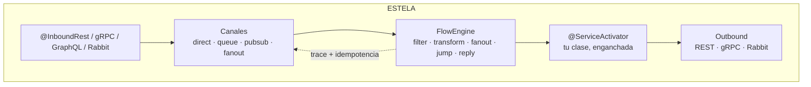
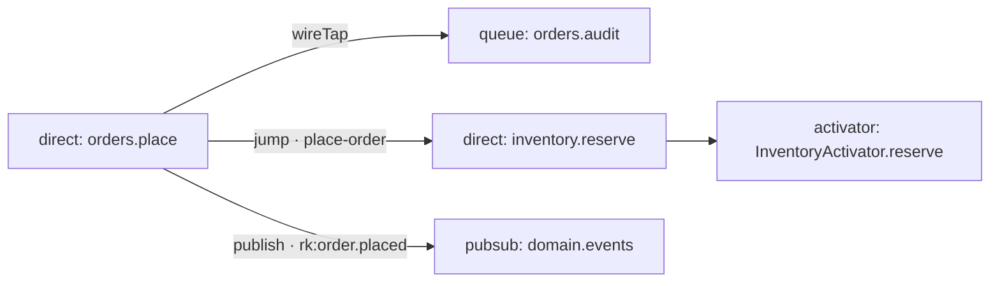

<div align="center">
  

  **El runtime de Enterprise Integration Patterns para NestJS.**
  *El flow habla con canales, no con clases.*

  [](#estado)
  [](#arquitectura)
  [](#instalaci%C3%B3n)
  [](#instalaci%C3%B3n)
  [](#licencia)
  [](https://www.dyddtech.com)
  [](https://www.linkedin.com/in/eliudiaz)
  [](https://github.com/eliudiaz-dydd)

  [English](./README.md) · **Español** · [Português](./README.pt.md) · [Français](./README.fr.md)

  [Instalación](#instalación) · [Quick start](#quick-start) · [Canales](#canales) · [DSL](#dsl-de-flows) · [Trazas](#trazas-e-idempotencia) · [Adaptadores inbound](#adaptadores-inbound-respuesta-e-idempotencia-a-medida) · [Observabilidad](#observabilidad) · [Arquitectura](#arquitectura)
</div>

---

## Por qué ESTELA

**Estela**: el rastro que deja un cometa. Cada mensaje que viaja por el runtime deja
huella — `traceId`, `spanId`, `history` de hops — y cada hop es un punto en la estela.
Semántica de Spring Integration, nativa de Node:

- **4 canales in-memory** con semántica EIP real: `direct` · `queue` · `pubsub` · `fanout`.
- **DSL de flows fluido** con 10 patrones: `filter → transform → wireTap → fanoutTo → jumpTo → publish → route → to → reply`.
- **Request/reply** con canales efímeros y timeouts race-free (`AbortSignal.timeout`).
- **Trazas** con `AsyncLocalStorage` + reconstrucción de contexto desde headers en cada hop.
- **Idempotencia** con scopes `flow:*` / `activator:*` y store intercambiable (memoria o Redis).
- **Inbound REST / gRPC / Rabbit / GraphQL** declarado en controllers, jamás en `forRoot`.
- **Grafo vivo** de tu topología: JSON + Mermaid en dos endpoints.
- **100% nativo**: mensajería sin brokers ni dependencias de runtime. Los brokers son puertos.



## Instalación

```bash
npm install https://github.com/dyddtechnologies/estela/releases/download/v0.1.0/estela-nest-0.1.0.tgz
```

> Distribuido como **artifact de GitHub Releases** (tarball) — sin registro npm.
> Peers: `@nestjs/common/core` ^10‖^11 · `@nestjs/swagger` ^7‖^8 · `reflect-metadata` · `rxjs`.
> Opcionales (solo tipos/adapters, **jamás** en el barrel): `amqplib` · `@grpc/grpc-js` · `@nestjs/graphql`.

## Quick start

```ts
@Module({
  imports: [
    IntegrationModule.forRoot(
      {
        channels: [
          { name: 'orders.place', type: 'direct' },
          { name: 'orders.audit', type: 'queue', capacity: 10_000 },
          { name: 'domain.events', type: 'pubsub' },
          { name: 'ops.fanout', type: 'fanout', bindings: ['inventory.reserve', 'billing.charge'] },
        ],
        idempotency: { enabled: true },
      },
      [PlaceOrderFlow],
    ),
  ],
  providers: [InventoryActivator],
})
export class AppModule {}
```

```ts
export const PlaceOrderFlow: FlowDefinition = {
  name: 'place-order',
  build: () =>
    IntegrationFlow.from('orders.place')
      .filter((p) => (p as { qty: number }).qty > 0)
      .transform((p) => ({ orderId: 'ord-1', ...(p as object), total: (p as { qty: number }).qty * 10 }))
      .wireTap('orders.audit')                                      // fire-and-forget, jamás falla
      .jumpTo([{ channel: 'inventory.reserve', timeoutMs: 3_000 }]) // wait → jumpReplies
      .publish('domain.events', 'order.placed')
      .reply()                                                      // cierra el HTTP si hay replyChannel
      .to('orders.persist'),
};
```

```ts
@Injectable()
export class InventoryActivator {
  @ServiceActivator('inventory.reserve')
  reserve(payload: unknown): string {
    return 'reserved'; // el wrapper responde al replyChannel del hop (jump incluido)
  }
}
```

```ts
@Controller('orders')
export class OrdersController {
  @Post()
  @InboundRest({ channel: 'orders.place', requestReply: true, timeoutMs: 5_000 })
  place(@Body() dto: PlaceOrderDto): void {} // → { status:'ok', result, headers }
}
```

## Canales

| Kind | Semántica |
|---|---|
| `direct` | 1 subscriber · `send` espera el handler · sin subscriber → throw |
| `queue` | buffer FIFO + round-robin · capacity · overflow → error (nunca drop silencioso) |
| `pubsub` | broadcast · glob `*`/`#` en routingKey · grupos round-robin · fallo aislado por subscriber |
| `fanout` | Composite: copia a bindings + subscribers · awaited o forget · **cycle guard A↔B** |

## DSL de flows

| Step | Semántica |
|---|---|
| `filter` | descarta con éxito (idempotencia `{filtered:true}`) |
| `transform` / `handle` | cambian el payload; `handle` no dispara reply |
| `wireTap` | copia sin bloquear; ignora errores (§17.6) |
| `fanoutTo` | grupo awaited en paralelo; `wait:false` → forget a `error.channel` |
| `jumpTo` / `jump` | canal efímero propio · await reply + timeout · `jumpReplies[channel]` |
| `publish` | `nextHop` + routingKey · no corta |
| `route` | dinámico `string \| string[]` · termina |
| `to` | envía y **termina** |
| `reply({payload})` | `'current'` \| `'jumpMerge'` → responde al `replyChannel` |

**Precedencia `replyChannel`** (invariante del runtime): `wireTap/fanout/publish → none` ·
`to/route → inherit` · `jump → efímero propio`. El padre siempre conserva el reply del inbound.

## Trazas e idempotencia

| Header | Mensaje |
|---|---|
| `x-trace-id` / `x-span-id` / `x-parent-span-id` | `traceId` · `spanId` · `parentSpanId` |
| `x-correlation-id` / `x-causation-id` | `correlationId` · `causationId` |
| `idempotency-key` / `x-idempotency-key` | `idempotencyKey` |

Scopes: `flow:${name}` · `activator:${Class}.${method}` · storage key `${scope}::${key}` ·
sin key → no-op · `enabled:false` → Null Object.

<details>
<summary><strong>Implementar <code>IdempotencyStore</code> con Redis (contrato only)</strong></summary>

```ts
export class RedisIdempotencyStore implements IdempotencyStore {
  private k = (scope: string, key: string) => `${scope}::${key}`;
  async begin(scope: string, key: string, ttlMs: number) {
    return (await this.redis.set(this.k(scope, key), 'in-flight', 'PX', ttlMs, 'NX')) === 'OK';
  }
  async complete(scope: string, key: string, result: Record<string, unknown>) {
    await this.redis.set(this.k(scope, key), JSON.stringify({ status: 'completed', result }), 'KEEPTTL');
  }
  async fail(scope: string, key: string, error: unknown) { /* KEEPTTL + status failed */ }
  async get(scope: string, key: string) { /* JSON → IdempotencyRecord | undefined */ }
  async purgeExpired() { return 0; } // TTL nativo de Redis
  // Opcional (0.6.0): permite que `onFailure: 'release'` del inbound libere la key y el reintento corra
  async release(scope: string, key: string) { await this.redis.del(this.k(scope, key)); }
}

forRoot({ channels, idempotency: { store: new RedisIdempotencyStore(redis) } });
```
</details>

## Adaptadores inbound: respuesta e idempotencia a medida

`@InboundRest`, `@InboundGrpc` y `@InboundGraphQL` lanzan un flujo desde un handler anotado. Desde
la 0.6.0 cada endpoint puede responder con **su propio contrato** y aplicar **sus propias reglas de
idempotencia**. Las opciones van en el decorador o, para todo el módulo, en `forRoot({ inbound })`;
el endpoint gana sobre el default del módulo y este sobre el de fábrica.

**Sin configurar nada, nada cambia**: el endpoint responde el envelope de estela
(`{status:'ok'|'accepted'|'duplicate', …}`) y deduplica por `idempotency-key` en el scope
`inbound:<channel>`, igual que en la 0.5.0.

### Mapeo de la respuesta

```ts
@InboundRest({ channel: 'orders.place', requestReply: true, reply: 'raw' })   // sólo el resultado del flujo

@InboundRest({
  channel: 'wf.start', requestReply: true,
  reply: ({ result, payload, receivedAt }: InboundReplyContext<StartPayload, StartResult>) => ({
    data: { ...result, correlationId: payload.correlationId, responseTime: Date.now() - receivedAt },
    success: true,
  }),
})

// gRPC: responder la forma del mensaje proto
@InboundGrpc({
  channel: 'wf.complete', requestReply: true,
  reply: ({ result, payload }: InboundReplyContext<CompleteInput, CompleteResult>) => ({
    instanceId: result.instanceId ?? payload.instanceId,
    resultJson: JSON.stringify(result),
  }),
})

// Un provider que inyecta servicios: se pasa una referencia, nunca la clase suelta
@InboundRest({ channel: 'orders.place', requestReply: true, reply: { useExisting: OrderReplyMapper } })

IntegrationModule.forRoot({ channels, inbound: { reply: 'raw' } }, flows);     // default del módulo
```

| `reply` | request/reply | fire-and-forget (accepted) | key repetida (duplicate) |
|---|---|---|---|
| `'envelope'` (default) | `{status:'ok', result, …}` | `{status:'accepted', …}` | `{status:'duplicate', …}` |
| `'raw'` | el resultado del flujo | lo que devuelve el handler | `{status:'duplicate', …}` |
| función · `{ mapReply }` · `{ useExisting }` | tu forma | tu forma | tu forma |

Un mapper propio recibe un `InboundReplyContext`: `kind` (`'reply' \| 'accepted' \| 'duplicate'`),
`result`, `payload`, `rawHeaders`, `handlerResult`, el `context` de Nest, `receivedAt`, `replayed`,
`duplicateOf`, `acceptedId`, el `message` y el `envelope` que estela habría respondido. Puede ser
async. Corre después de escribir el registro de idempotencia, así que un mapper que lanza nunca
libera ni marca como fallida la key.

### Opciones de idempotencia

```ts
@InboundRest({ channel, idempotency: false })            // sin claim inbound en este endpoint
@InboundRest({ channel, idempotency: { /* opciones */ } })
IntegrationModule.forRoot({ channels, inbound: { idempotency: { /* opciones */ } } }, flows);
```

| Opción | Default | Significado |
|---|---|---|
| `enabled` | `true` | `false` omite el claim. **No se hereda**: un endpoint que pasa un objeto de opciones queda habilitado salvo que diga lo contrario, aunque el default del módulo sea `false`. |
| `clientKey` | `idempotency-key`, `x-idempotency-key` | De dónde sale la key del cliente: un header, una lista de headers (sin distinguir mayúsculas) o `(ctx) => string \| undefined`. |
| `key` | la key del cliente | Resolver de la key de almacenamiento: función, `{ resolveKey }` o `{ useExisting }`. Recibe `payload`, `rawHeaders`, `context`, `clientKey`. Devuelve un string (se usa tal cual), un array de partes (se escapan y se unen con `:`), `{ scope, key }`, o `undefined`/`null` para omitir el claim. Puede ser async. **Puede lanzar**: el request se rechaza y no se reclama nada. Se llama aunque el cliente no envíe key, así que valida `clientKey`: una key vacía o una parte que no sea un string no vacío o un número finito (`undefined`, `null`, `''`) se rechaza con `InboundError` en vez de fusionar llamadores en una sola key. |
| `scope` | `inbound:<channel>` | Scope de almacenamiento (storage key = `${scope}::${key}`). |
| `ttlMs` | `idempotency.ttlMs` del módulo, si no 1 h | TTL que recibe `store.begin`. |
| `store` | el `IdempotencyService` del módulo | Una instancia de `IdempotencyStore` o `{ useExisting }`. |
| `onDuplicate` | `'envelope'` | `'replay'` responde un repetido completado **por el mismo mapper** que la primera vez. |
| `onInFlight` | `'duplicate'` | `'reject'` lanza `InboundIdempotencyInFlightError`; una función devuelve el error a lanzar. |
| `onFailure` | `'keep'` | `'release'`, `'store'`, `'marker'`, o un clasificador `(error, ctx) => 'keep' \| 'release' \| 'store'` (función, `{ classify }`, `{ useExisting }`). |
| `failureCodec` | `HttpExceptionFailureCodec` | `{ serialize, deserialize }` para los fallos almacenados. |
| `forward` | ver [Propagación](#propagación-de-la-key-aguas-abajo) | `'raw' \| 'resolved' \| 'none'`. |

**Una key repetida** (`store.begin` devolvió `false`):

| Registro almacenado | `onDuplicate: 'envelope'` | `onDuplicate: 'replay'` |
|---|---|---|
| request/reply completado | duplicate (`result` = resultado cacheado) | se mapea como `kind:'reply'`, `replayed:true` |
| fire-and-forget completado | duplicate (`result: null`) | se mapea como `kind:'accepted'` con el id almacenado |
| fallo almacenado | relanza el error almacenado | relanza el error almacenado |
| fallido y retenido | duplicate (`duplicateOf:'failed'`, `result: null`) | igual |
| todavía en vuelo | `onInFlight` | `onInFlight` |

**Un despacho fallido** (la primera ejecución siempre relanza el mismo error, sin tocarlo):

| Acción | Llamada al store | Siguiente request con la misma key |
|---|---|---|
| `keep` | `fail()` | se responde como duplicate hasta que expire el TTL |
| `release` | `release()` | se ejecuta de verdad |
| `store` | `complete()` con el fallo serializado | relanza el fallo deserializado |

Cómo se elige la acción: `'keep'` (default) ignora todo. Cualquier otro `onFailure` respeta primero
la marca puesta en el error con `markInboundFailure(error, action)`; sin marca, `'marker'` retiene,
`'release'`/`'store'` se aplican (salvo a un `ReplyTimeoutError` o un `NoSubscriberError`, que se
retienen porque el flujo puede seguir corriendo o haber terminado sin ser respondido) y un
clasificador decide. Un flujo sobre canales esperados que excede `timeoutMs` aparece como
`ReplyTimeoutError`. El codec por defecto conserva status y body de un
`HttpException` de Nest; cualquier otro error se reproduce como `InboundReplayedFailureError`, que
Nest responde como 500. No se guarda el stack.

### Ejemplo multi-tenant

```ts
@Injectable()
export class TenantKeyResolver implements InboundKeyResolver<CompletePayload> {
  constructor(private readonly steps: StepGuard) {}

  async resolveKey({ payload, clientKey }: InboundKeyContext<CompletePayload>) {
    await this.steps.assertCompletable(payload);      // un request rechazado nunca reclama key
    if (clientKey === undefined) return undefined;    // sin key: sin idempotencia
    return {
      scope: 'wf-complete',
      key: [payload.tenantId, payload.flowId, payload.stepId, clientKey],   // atada al tenant
    };
  }
}

@Post(':flowId/steps/:stepId/complete')
@InboundRest({
  channel: 'wf.complete',
  requestReply: true,
  reply: 'raw',
  idempotency: {
    key: { useExisting: TenantKeyResolver },
    store: { useExisting: PgIdempotencyStore },       // tu propio provider de IdempotencyStore
    onDuplicate: 'replay',                            // el repetido recibe la primera respuesta
    onInFlight: () => new ConflictException('IDEMPOTENCY_KEY_IN_PROGRESS'),   // HTTP 409
    onFailure: 'marker',                              // decide el código de negocio, por error
  },
})
complete(@Param() params: CompleteParams, @Tenant() tenantId: string, @Body() body: CompleteBody) {
  return { ...params, tenantId, ...body };            // lo que devuelve es el payload del flujo
}

// Donde ocurre el trabajo (activator, saga…): decir qué implica el fallo para la key
throw markInboundFailure(error, committedLevels === 0 ? 'release' : 'store');
```

Dos tenants que envían el mismo `Idempotency-Key` tienen ahora dos keys de almacenamiento distintas,
así que ninguno puede recibir la respuesta cacheada del otro. Un error de validación libera la key y
el reintento se ejecuta; un fallo con trabajo parcialmente confirmado se almacena y cada reintento
recibe el mismo error HTTP.

### Propagación de la key aguas abajo

El `headers.idempotencyKey` del mensaje despachado es lo que deduplican los scopes `flow:<name>` y
`activator:<Class>.<method>`.

| `forward` | Los scopes de flujo y activator ven |
|---|---|
| `'raw'` | la key del cliente |
| `'resolved'` | la key de almacenamiento codificada (atada al tenant si tu resolver lo está) |
| `'none'` | nada |

El default es `'raw'`. Pasa a `'none'` en cuanto se configura `key` o un `onFailure` distinto de
`'keep'`: una key cruda aguas abajo permitiría que dos tenants se bloqueen en el scope del flujo, y
una key liberada en el scope inbound pero aún reclamada por el flujo convertiría el reintento en un
duplicate silencioso del flujo (un `ReplyTimeoutError`). Por eso se rechaza combinar un `onFailure`
con `'raw'` o `'resolved'` explícitos.

Con el claim apagado (`idempotency: false`) nada responde una repetición en el scope inbound, así que
el default es `'none'` en un endpoint `requestReply` o cuando hay un resolver `key` configurado, y
`'raw'` en un endpoint fire-and-forget simple. Usa `forward: 'raw'` para propagar la key igualmente.

Una opción presente con valor `undefined` en un endpoint hereda el default del módulo; nunca lo
borra.

### Advertencias

- Guards, pipes y el cuerpo del handler corren **antes** del claim y otra vez en cada repetido:
  validar ahí es seguro, pero los efectos secundarios del handler no se deduplican.
- `idempotency: false` apaga el claim inbound. En un endpoint fire-and-forget el header sigue
  viajando en los headers del mensaje, así que flujos y activators siguen deduplicando por él; agrega
  `forward: 'none'` para apagar eso también. En un endpoint `requestReply` no se propaga salvo que
  pidas `forward: 'raw'` (una repetición descartada por el scope del flujo terminaría en un timeout
  de reply). Los headers crudos del request siempre llegan a tu handler, diga lo que diga `forward`.
- `{ useExisting }` resuelve sólo providers singleton (no request ni transient), una vez, en el
  primer request del endpoint. Una mala configuración aparece como `InboundError` en ese request.
- GraphQL: la búsqueda de headers por defecto no ve los headers del request. Define `clientKey`
  (por ejemplo `clientKey: 'idempotency-key'`) para tener idempotencia inbound en un resolver.
- `InboundIdempotencyInFlightError` trae `code: 'IDEMPOTENCY_KEY_IN_PROGRESS'`; mapéalo a HTTP 409
  o a un status gRPC en tu propio exception filter.
- Con el envelope por defecto, un request/reply reproducido trae `id`/`traceId` nuevos; usa `'raw'`
  o un mapper propio cuando los repetidos deban ser idénticos byte a byte.
- Los DTOs de swagger (`InboundReplyDto`, …) describen sólo el envelope por defecto.
- Un store propio sin el `release()` opcional sigue funcionando: `onFailure: 'release'` se rechaza
  para él, y un clasificador que responde `'release'` degrada a `keep` con un único warning.

## Observabilidad

```bash
curl localhost:3000/integration/graph          # nodes · edges · flows (JSON)
curl localhost:3000/integration/graph/mermaid  # topología como Mermaid
```



El log de arranque lista cada punto de entrada cableado: una línea por activator y una por
endpoint inbound anotado (`@InboundRest` / `@InboundGrpc` / `@InboundGraphQL`); cada inbound
queda además registrado en el graph:

```
activator: InventoryActivator.reserve -> inventory.reserve
inbound rest: POST /V1/Workflows/:id/Start -> wf.start (request-reply)
inbound grpc: WorkflowLifecycleService/Start -> wf.start (request-reply)
inbound graphql: mutation placeOrder -> orders.place
```

Solo se imprimen transporte, ruta o patrón, canal y el flag request-reply. Si la metadata de
ruta no se puede leer, la línea usa `Class.method`. El warning de `AMQP_CHANNEL` ausente solo
se emite cuando hay `rabbitMappings` declarados sin `rabbitChannel`.

## Arquitectura

Hexagonal (puertos y adaptadores) con SOLID y GoF explícitos:
`FlowStep` = **Command** · `FlowExecutor` = **Template Method** · `IntegrationFlow` = **Builder** ·
`FanoutChannel` = **Composite** · `ChannelRegistry` = **Mediator** · canales/stores = **Strategy** ·
`nextHop` = **Prototype** · `NoopIdempotencyStore` = **Null Object** · canales efímeros = **Proxy**.

```text
interface (decorators · interceptor · controller · module · testing)
        ↓
application (flow-executor · activator-wrapper · registry · gateway · graph)
        ↓
domain (message · channel · flow-step)          ← cero dependencias, enforced
        ↳ infrastructure: canales in-memory · memory store · rest/grpc/rabbit adapters
```

Motor event-driven 100% nativo Node ≥ 18: `node:events` · `AsyncLocalStorage` +
`AsyncResource.bind` · `AbortSignal.timeout` · `Promise.all/allSettled` · `setImmediate` ·
`OnApplicationShutdown` (drain de queues).

## Testing

```ts
import { bindFlow, createTestMessage, waitFor, MemoryIdempotencyStore } from '@estela/nest/testing';

bindFlow(PlaceOrderFlow, registry, { idempotency: new IdempotencyService({ store: new MemoryIdempotencyStore() }) });
await registry.send('orders.place', { qty: 2, sku: 'A' });
const reply = await waitFor(registry, 'reply.http-1', 2_000);
```

## Estado

| | |
|---|---|
| Tests | **301/301** · 28 suites · e2e HTTP real |
| Spec | 10/10 tests mínimos · DoD §15 completo |
| Boundaries | dominio puro · barrel sin brokers · testing sin inbound (0 violaciones) |
| Build | ESM + CJS + d.ts · Node ≥ 18 |

Example runnable: [`src/example/`](./src/example) · Scripts: `npm run verify` (typecheck → build → test → bounds).

---

<div align="center">

<sub>**ESTELA** — construida con ☄️ por [**DYDD Technologies**](https://www.dyddtech.com) · creada y mantenida por [**Eliu Diaz**](https://www.linkedin.com/in/eliudiaz) · único mantainer [@eliudiaz-dydd](https://github.com/eliudiaz-dydd)</sub>

</div>

## Licencia

MIT
