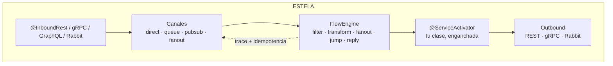
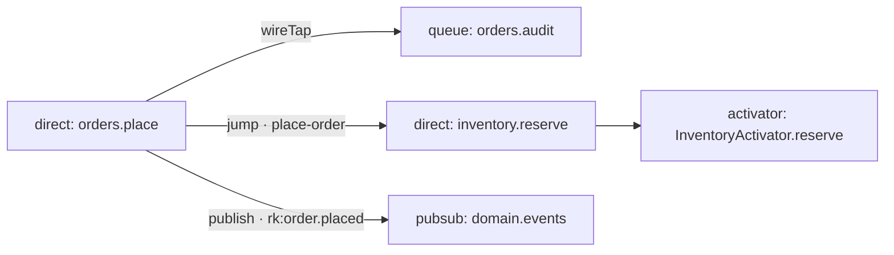

<div align="center">
  

  **El runtime de Enterprise Integration Patterns para NestJS.**
  *El flow habla con canales, no con clases.*

  [](#-estado)
  [](#arquitectura)
  [](#instalaci%C3%B3n)
  [](#instalaci%C3%B3n)
  [](#licencia)

  [Instalación](#instalación) · [Quick start](#quick-start) · [Canales](#canales) · [DSL](#dsl-de-flows) · [Trazas](#trazas-e-idempotencia) · [Observabilidad](#observabilidad) · [Arquitectura](#arquitectura)
</div>

---

## Por qué ESTELA

**Estela** *(del lat. *stella* — la estela que deja un cometa)*: cada mensaje que
viaja por el runtime deja rastro — `traceId`, `spanId`, `history` de hops — y cada
hop es un punto en la estela. Como Spring Integration, pero nativo de Node:

- **4 canales in-memory** con semántica EIP real: `direct` · `queue` · `pubsub` · `fanout`.
- **DSL de flows fluido** con 10 patrones: `filter → transform → wireTap → fanoutTo → jumpTo → publish → route → to → reply`.
- **Request/reply** con canales efímeros y timeouts race-free (`AbortSignal.timeout`).
- **Trazas** con `AsyncLocalStorage` + reconstrucción de contexto desde headers en cada hop.
- **Idempotencia** con scopes `flow:*` / `activator:*` y store intercambiable (memoria o Redis).
- **Inbound REST / gRPC / Rabbit / GraphQL** declarado en controllers, jamás en `forRoot`.
- **Grafo vivo** de tu topología: JSON + Mermaid en dos endpoints.
- **100% nativo**: mensajería sin brokers ni dependencias de runtime. Los brokers son puertos.



## Instalación

```bash
npm install @acme/nest-integration
```

Peers: `@nestjs/common/core` ^10‖^11 · `@nestjs/swagger` ^7‖^8 · `reflect-metadata` · `rxjs`.
Opcionales (solo tipos/adapters, **jamás** en el barrel): `amqplib` · `@grpc/grpc-js` · `@nestjs/graphql`.

## Quick start

```ts
@Module({
  imports: [
    IntegrationModule.forRoot(
      {
        channels: [
          { name: 'orders.place', type: 'direct' },
          { name: 'orders.audit', type: 'queue', capacity: 10_000 },
          { name: 'domain.events', type: 'pubsub' },
          { name: 'ops.fanout', type: 'fanout', bindings: ['inventory.reserve', 'billing.charge'] },
        ],
        idempotency: { enabled: true },
      },
      [PlaceOrderFlow],
    ),
  ],
  providers: [InventoryActivator],
})
export class AppModule {}
```

```ts
export const PlaceOrderFlow: FlowDefinition = {
  name: 'place-order',
  build: () =>
    IntegrationFlow.from('orders.place')
      .filter((p) => (p as { qty: number }).qty > 0)
      .transform((p) => ({ orderId: 'ord-1', ...(p as object), total: (p as { qty: number }).qty * 10 }))
      .wireTap('orders.audit')                                      // fire-and-forget, jamás falla
      .jumpTo([{ channel: 'inventory.reserve', timeoutMs: 3_000 }]) // wait → jumpReplies
      .publish('domain.events', 'order.placed')
      .reply()                                                      // cierra el HTTP si hay replyChannel
      .to('orders.persist'),
};
```

```ts
@Injectable()
export class InventoryActivator {
  @ServiceActivator('inventory.reserve')
  reserve(payload: unknown): string {
    return 'reserved'; // el wrapper responde al replyChannel del hop (jump incluido)
  }
}
```

```ts
@Controller('orders')
export class OrdersController {
  @Post()
  @InboundRest({ channel: 'orders.place', requestReply: true, timeoutMs: 5_000 })
  place(@Body() dto: PlaceOrderDto): void {} // → { status:'ok', result, headers }
}
```

## Canales

| Kind | Semántica |
|---|---|
| `direct` | 1 subscriber · `send` espera el handler · sin subscriber → throw |
| `queue` | buffer FIFO + round-robin · capacity · overflow → error (nunca drop silencioso) |
| `pubsub` | broadcast · glob `*`/`#` en routingKey · grupos round-robin · fallo aislado por subscriber |
| `fanout` | Composite: copia a bindings + subscribers · awaited o forget · **cycle guard A↔B** |

## DSL de flows

| Step | Semántica |
|---|---|
| `filter` | descarta con éxito (idempotencia `{filtered:true}`) |
| `transform` / `handle` | cambian el payload; `handle` no dispara reply |
| `wireTap` | copia sin bloquear; ignora errores (§17.6) |
| `fanoutTo` | grupo awaited en paralelo; `wait:false` → forget a `error.channel` |
| `jumpTo` / `jump` | canal efímero propio · await reply + timeout · `jumpReplies[channel]` |
| `publish` | `nextHop` + routingKey · no corta |
| `route` | dinámico `string \| string[]` · termina |
| `to` | envía y **termina** |
| `reply({payload})` | `'current'` \| `'jumpMerge'` → responde al `replyChannel` |

**Precedencia `replyChannel`** (invariante del runtime): `wireTap/fanout/publish → none` ·
`to/route → inherit` · `jump → efímero propio`. El padre siempre conserva el reply del inbound.

## Trazas e idempotencia

| Header | Mensaje |
|---|---|
| `x-trace-id` / `x-span-id` / `x-parent-span-id` | `traceId` · `spanId` · `parentSpanId` |
| `x-correlation-id` / `x-causation-id` | `correlationId` · `causationId` |
| `idempotency-key` / `x-idempotency-key` | `idempotencyKey` |

Scopes: `flow:${name}` · `activator:${Class}.${method}` · storage key `${scope}::${key}` ·
sin key → no-op · `enabled:false` → Null Object.

<details>
<summary><strong>Implementar <code>IdempotencyStore</code> con Redis (contrato only)</strong></summary>

```ts
export class RedisIdempotencyStore implements IdempotencyStore {
  private k = (scope: string, key: string) => `${scope}::${key}`;
  async begin(scope: string, key: string, ttlMs: number) {
    return (await this.redis.set(this.k(scope, key), 'in-flight', 'PX', ttlMs, 'NX')) === 'OK';
  }
  async complete(scope: string, key: string, result: Record<string, unknown>) {
    await this.redis.set(this.k(scope, key), JSON.stringify({ status: 'completed', result }), 'KEEPTTL');
  }
  async fail(scope: string, key: string, error: unknown) { /* KEEPTTL + status failed */ }
  async get(scope: string, key: string) { /* JSON → IdempotencyRecord | undefined */ }
  async purgeExpired() { return 0; } // TTL nativo de Redis
}

forRoot({ channels, idempotency: { store: new RedisIdempotencyStore(redis) } });
```
</details>

## Observabilidad

```bash
curl localhost:3000/integration/graph          # nodes · edges · flows (JSON)
curl localhost:3000/integration/graph/mermaid  # topología como Mermaid
```



## Arquitectura

Hexagonal (puertos y adaptadores) con SOLID y patrones GoF explícitos:
`FlowStep` = **Command** · `FlowExecutor` = **Template Method** · `IntegrationFlow` = **Builder** ·
`FanoutChannel` = **Composite** · `ChannelRegistry` = **Mediator** · canales/stores = **Strategy** ·
`nextHop` = **Prototype** · `NoopIdempotencyStore` = **Null Object** · canales efímeros = **Proxy**.

```text
interface (decorators · interceptor · controller · module · testing)
        ↓
application (flow-executor · activator-wrapper · registry · gateway · graph)
        ↓
domain (message · channel · flow-step)          ← cero dependencias, enforced
        ↳ infrastructure: canales in-memory · memory store · rest/grpc/rabbit adapters
```

Motor event-driven 100% nativo Node ≥ 18: `node:events` · `AsyncLocalStorage` +
`AsyncResource.bind` · `AbortSignal.timeout` · `Promise.all/allSettled` · `setImmediate` ·
`OnApplicationShutdown` (drain de queues). **Diseño completo, ADRs y decisión por decisión:
[PLAN-arquitectura.md](./PLAN-arquitectura.md)** · Contrato funcional: [SPEC](./SPEC-nest-integration.md).

## Testing

```ts
import { bindFlow, createTestMessage, waitFor, MemoryIdempotencyStore } from '@acme/nest-integration/testing';

bindFlow(PlaceOrderFlow, registry, { idempotency: new IdempotencyService({ store: new MemoryIdempotencyStore() }) });
await registry.send('orders.place', { qty: 2, sku: 'A' });
const reply = await waitFor(registry, 'reply.http-1', 2_000);
```

## Estado

| | |
|---|---|
| Tests | **110/110** · 18 suites · e2e HTTP real |
| Spec | 10/10 tests mínimos · DoD §15 completo |
| Boundaries | dominio puro · barrel sin brokers · testing sin inbound (0 violaciones) |
| Build | ESM + CJS + d.ts · Node ≥ 18 |

Example runnable: [`src/example/`](./src/example) · Scripts: `npm run verify` (typecheck → build → test → bounds).

## Licencia

MIT
