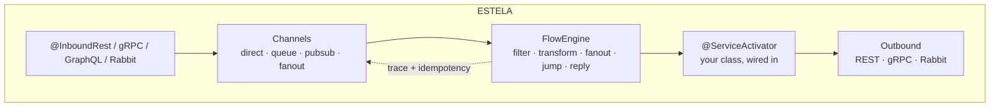
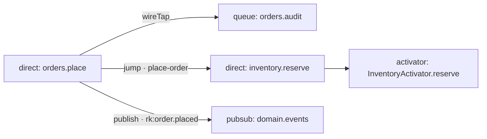

<div align="center">
  

  **The Enterprise Integration Patterns runtime for NestJS.**
  *The flow talks to channels, not to classes.*

  [](#status)
  [](#architecture)
  [](#installation)
  [](#installation)
  [](#license)
  [](https://www.dyddtech.com)
  [](https://www.linkedin.com/in/eliudiaz)
  [](https://github.com/eliudiaz-dydd)

  **English** · [Español](./README.es.md) · [Português](./README.pt.md) · [Français](./README.fr.md)

  [Installation](#installation) · [Quick start](#quick-start) · [Channels](#channels) · [Flow DSL](#flow-dsl) · [Tracing](#tracing--idempotency) · [Observability](#observability) · [Architecture](#architecture)
</div>

---

## Why ESTELA

**Estela** *(Spanish for “trail” — the wake a comet leaves behind)*: every message
traveling through the runtime leaves a trail — `traceId`, `spanId`, a `history` of
hops — and every hop is a point in that trail. Spring Integration semantics, native to Node:

- **4 in-memory channels** with real EIP semantics: `direct` · `queue` · `pubsub` · `fanout`.
- **Fluid flow DSL** with 10 patterns: `filter → transform → wireTap → fanoutTo → jumpTo → publish → route → to → reply`.
- **Request/reply** with ephemeral channels and race-free timeouts (`AbortSignal.timeout`).
- **Tracing** via `AsyncLocalStorage`, with context rebuilt from headers at every hop.
- **Idempotency** with `flow:*` / `activator:*` scopes and a swappable store (memory or Redis).
- **Inbound REST / gRPC / Rabbit / GraphQL** declared on controllers, never in `forRoot`.
- **Live topology graph**: JSON + Mermaid, two endpoints.
- **100% native**: messaging with zero runtime dependencies. Brokers are ports.



## Installation

```bash
npm install @estela/nest
```

Peers: `@nestjs/common/core` ^10‖^11 · `@nestjs/swagger` ^7‖^8 · `reflect-metadata` · `rxjs`.
Optional (typed/adapters only, **never** in the barrel): `amqplib` · `@grpc/grpc-js` · `@nestjs/graphql`.

## Quick start

```ts
@Module({
  imports: [
    IntegrationModule.forRoot(
      {
        channels: [
          { name: 'orders.place', type: 'direct' },
          { name: 'orders.audit', type: 'queue', capacity: 10_000 },
          { name: 'domain.events', type: 'pubsub' },
          { name: 'ops.fanout', type: 'fanout', bindings: ['inventory.reserve', 'billing.charge'] },
        ],
        idempotency: { enabled: true },
      },
      [PlaceOrderFlow],
    ),
  ],
  providers: [InventoryActivator],
})
export class AppModule {}
```

```ts
export const PlaceOrderFlow: FlowDefinition = {
  name: 'place-order',
  build: () =>
    IntegrationFlow.from('orders.place')
      .filter((p) => (p as { qty: number }).qty > 0)
      .transform((p) => ({ orderId: 'ord-1', ...(p as object), total: (p as { qty: number }).qty * 10 }))
      .wireTap('orders.audit')                                      // fire-and-forget, never fails
      .jumpTo([{ channel: 'inventory.reserve', timeoutMs: 3_000 }]) // wait → jumpReplies
      .publish('domain.events', 'order.placed')
      .reply()                                                      // closes the HTTP reply if present
      .to('orders.persist'),
};
```

```ts
@Injectable()
export class InventoryActivator {
  @ServiceActivator('inventory.reserve')
  reserve(payload: unknown): string {
    return 'reserved'; // the wrapper answers the hop's replyChannel (jumps included)
  }
}
```

```ts
@Controller('orders')
export class OrdersController {
  @Post()
  @InboundRest({ channel: 'orders.place', requestReply: true, timeoutMs: 5_000 })
  place(@Body() dto: PlaceOrderDto): void {} // → { status:'ok', result, headers }
}
```

## Channels

| Kind | Semantics |
|---|---|
| `direct` | 1 subscriber · `send` awaits the handler · no subscriber → throws |
| `queue` | FIFO buffer + round-robin · capacity · overflow → error (never a silent drop) |
| `pubsub` | broadcast · `*`/`#` glob routing keys · round-robin groups · per-subscriber fault isolation |
| `fanout` | Composite: copies to bindings + subscribers · awaited or forget · **A↔B cycle guard** |

## Flow DSL

| Step | Semantics |
|---|---|
| `filter` | exits successfully (idempotency `{filtered:true}`) |
| `transform` / `handle` | replace the payload; `handle` never triggers a reply |
| `wireTap` | fire-and-forget copy; swallows errors |
| `fanoutTo` | awaited group in parallel; `wait:false` → forget → `error.channel` |
| `jumpTo` / `jump` | own ephemeral channel · awaits reply + timeout · `jumpReplies[channel]` |
| `publish` | `nextHop` + routingKey · does not cut the pipeline |
| `route` | dynamic `string \| string[]` · terminates |
| `to` | sends and **terminates** |
| `reply({payload})` | `'current'` \| `'jumpMerge'` → answers the `replyChannel` |

**`replyChannel` precedence** (runtime invariant): `wireTap/fanout/publish → none` ·
`to/route → inherit` · `jump → its own ephemeral`. The parent always keeps the inbound reply.

## Tracing & idempotency

| Header | Message field |
|---|---|
| `x-trace-id` / `x-span-id` / `x-parent-span-id` | `traceId` · `spanId` · `parentSpanId` |
| `x-correlation-id` / `x-causation-id` | `correlationId` · `causationId` |
| `idempotency-key` / `x-idempotency-key` | `idempotencyKey` |

Scopes: `flow:${name}` · `activator:${Class}.${method}` · storage key `${scope}::${key}` ·
no key → no-op · `enabled:false` → Null Object.

<details>
<summary><strong>Implementing <code>IdempotencyStore</code> with Redis (contract only)</strong></summary>

```ts
export class RedisIdempotencyStore implements IdempotencyStore {
  private k = (scope: string, key: string) => `${scope}::${key}`;
  async begin(scope: string, key: string, ttlMs: number) {
    return (await this.redis.set(this.k(scope, key), 'in-flight', 'PX', ttlMs, 'NX')) === 'OK';
  }
  async complete(scope: string, key: string, result: Record<string, unknown>) {
    await this.redis.set(this.k(scope, key), JSON.stringify({ status: 'completed', result }), 'KEEPTTL');
  }
  async fail(scope: string, key: string, error: unknown) { /* KEEPTTL + failed status */ }
  async get(scope: string, key: string) { /* JSON → IdempotencyRecord | undefined */ }
  async purgeExpired() { return 0; } // native Redis TTL
}

forRoot({ channels, idempotency: { store: new RedisIdempotencyStore(redis) } });
```
</details>

## Observability

```bash
curl localhost:3000/integration/graph          # nodes · edges · flows (JSON)
curl localhost:3000/integration/graph/mermaid  # topology as Mermaid
```



## Architecture

Hexagonal (ports & adapters) with explicit SOLID + GoF:
`FlowStep` = **Command** · `FlowExecutor` = **Template Method** · `IntegrationFlow` = **Builder** ·
`FanoutChannel` = **Composite** · `ChannelRegistry` = **Mediator** · channels/stores = **Strategy** ·
`nextHop` = **Prototype** · `NoopIdempotencyStore` = **Null Object** · ephemeral channels = **Proxy**.

```text
interface (decorators · interceptor · controller · module · testing)
        ↓
application (flow-executor · activator-wrapper · registry · gateway · graph)
        ↓
domain (message · channel · flow-step)          ← zero dependencies, enforced
        ↳ infrastructure: in-memory channels · memory store · rest/grpc/rabbit adapters
```

Event-driven engine, 100% native Node ≥ 18: `node:events` · `AsyncLocalStorage` +
`AsyncResource.bind` · `AbortSignal.timeout` · `Promise.all/allSettled` · `setImmediate` ·
`OnApplicationShutdown` (queue drain). **Full design, ADRs and decision-by-decision rationale:
[PLAN-arquitectura.md](./PLAN-arquitectura.md)** (Spanish, canonical) · Functional contract: [SPEC](./SPEC-nest-integration.md).

## Agent skills

ESTELA ships portable **agent skills** (SKILL.md) so Claude Code, Codex, Cursor and any
SKILL.md-compatible agent adopt it as the messaging standard:

| Skill | Use when… |
|---|---|
| [`estela-setup`](./skills/estela-setup/SKILL.md) | wiring `IntegrationModule.forRoot` into a Nest app |
| [`estela-flows`](./skills/estela-flows/SKILL.md) | authoring channels/flows/activators |
| [`estela-testing`](./skills/estela-testing/SKILL.md) | writing deterministic tests |
| [`estela-review`](./skills/estela-review/SKILL.md) | reviewing PRs against the invariants |

Install: copy a folder into `~/.codex/skills/`, `~/.claude/skills/` or `.agents/skills/` —
details in [`skills/README.md`](./skills/README.md). Repo-root agent rules: [`AGENTS.md`](./AGENTS.md).

## Testing

```ts
import { bindFlow, createTestMessage, waitFor, MemoryIdempotencyStore } from '@estela/nest/testing';

bindFlow(PlaceOrderFlow, registry, { idempotency: new IdempotencyService({ store: new MemoryIdempotencyStore() }) });
await registry.send('orders.place', { qty: 2, sku: 'A' });
const reply = await waitFor(registry, 'reply.http-1', 2_000);
```

## Status

| | |
|---|---|
| Tests | **110/110** · 18 suites · real HTTP e2e |
| Spec | 10/10 minimal tests · DoD §15 complete |
| Boundaries | pure domain · broker-free barrel · testing w/o inbound (0 violations) |
| Build | ESM + CJS + d.ts · Node ≥ 18 |

Runnable example: [`src/example/`](./src/example) · `npm run verify` = typecheck → **eslint (type-checked + sonarjs + security)** → prettier → build → jest → bounds → **madge + jscpd** → **npm audit + lockfile-lint**.

---

<div align="center">

<sub>**ESTELA** — built with ☄️ by [**DYDD Technologies**](https://www.dyddtech.com) · created & maintained by [**Eliu Diaz**](https://www.linkedin.com/in/eliudiaz) · sole maintainer [@eliudiaz-dydd](https://github.com/eliudiaz-dydd)</sub>

</div>

## License

MIT
