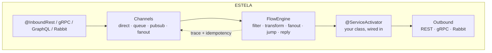
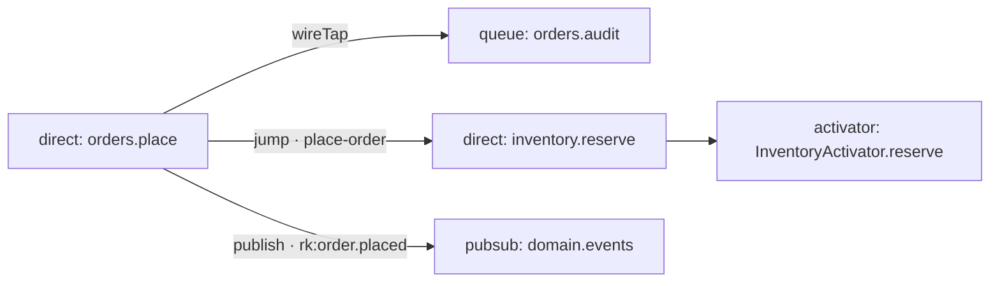

<div align="center">
  

  **The Enterprise Integration Patterns runtime for NestJS.**
  *The flow talks to channels, not to classes.*

  [](#status)
  [](#architecture)
  [](#installation)
  [](#installation)
  [](#license)
  [](https://www.dyddtech.com)
  [](https://www.linkedin.com/in/eliudiaz)
  [](https://github.com/eliudiaz-dydd)

  **English** · [Español](./README.es.md) · [Português](./README.pt.md) · [Français](./README.fr.md)

  [Installation](#installation) · [Quick start](#quick-start) · [Channels](#channels) · [Flow DSL](#flow-dsl) · [Tracing](#tracing--idempotency) · [Inbound adapters](#inbound-adapters-reply-mapping--idempotency) · [Observability](#observability) · [Architecture](#architecture)
</div>

---

## Why ESTELA

**Estela** *(Spanish for “trail” — the wake a comet leaves behind)*: every message
traveling through the runtime leaves a trail — `traceId`, `spanId`, a `history` of
hops — and every hop is a point in that trail. Spring Integration semantics, native to Node:

- **4 in-memory channels** with real EIP semantics: `direct` · `queue` · `pubsub` · `fanout`.
- **Fluid flow DSL** with 10 patterns: `filter → transform → wireTap → fanoutTo → jumpTo → publish → route → to → reply`.
- **Request/reply** with ephemeral channels and race-free timeouts (`AbortSignal.timeout`).
- **Tracing** via `AsyncLocalStorage`, with context rebuilt from headers at every hop.
- **Idempotency** with `flow:*` / `activator:*` scopes and a swappable store (memory or Redis).
- **Inbound REST / gRPC / Rabbit / GraphQL** declared on controllers, never in `forRoot`.
- **Live topology graph**: JSON + Mermaid, two endpoints.
- **100% native**: messaging with zero runtime dependencies. Brokers are ports.


```mermaid
flowchart LR
  subgraph ESTELA
    direction LR
    IN["@InboundRest / gRPC / GraphQL / Rabbit"] --> C["Channels\ndirect · queue · pubsub · fanout"]
    C --> F["FlowEngine\nfilter · transform · fanout · jump · reply"]
    F --> A["@ServiceActivator\nyour class, wired in"]
    A --> OUT["Outbound\nREST · gRPC · Rabbit"]
    F -.trace + idempotency.-> C
  end
```

## Installation

```bash
npm install https://github.com/dyddtechnologies/estela/releases/download/v0.1.0/estela-nest-0.1.0.tgz
```

> Distributed as a **GitHub Release artifact** (packed tarball) — no npm registry needed.
> Peers: `@nestjs/common/core` ^10‖^11 · `@nestjs/swagger` ^7‖^8 · `reflect-metadata` · `rxjs`.
> Optional (typed/adapters only, **never** in the barrel): `amqplib` · `@grpc/grpc-js` · `@nestjs/graphql`.

## Quick start

```ts
@Module({
  imports: [
    IntegrationModule.forRoot(
      {
        channels: [
          { name: 'orders.place', type: 'direct' },
          { name: 'orders.audit', type: 'queue', capacity: 10_000 },
          { name: 'domain.events', type: 'pubsub' },
          { name: 'ops.fanout', type: 'fanout', bindings: ['inventory.reserve', 'billing.charge'] },
        ],
        idempotency: { enabled: true },
      },
      [PlaceOrderFlow],
    ),
  ],
  providers: [InventoryActivator],
})
export class AppModule {}
```

```ts
export const PlaceOrderFlow: FlowDefinition = {
  name: 'place-order',
  build: () =>
    IntegrationFlow.from('orders.place')
      .filter((p) => (p as { qty: number }).qty > 0)
      .transform((p) => ({ orderId: 'ord-1', ...(p as object), total: (p as { qty: number }).qty * 10 }))
      .wireTap('orders.audit')                                      // fire-and-forget, never fails
      .jumpTo([{ channel: 'inventory.reserve', timeoutMs: 3_000 }]) // wait → jumpReplies
      .publish('domain.events', 'order.placed')
      .reply()                                                      // closes the HTTP reply if present
      .to('orders.persist'),
};
```

```ts
@Injectable()
export class InventoryActivator {
  @ServiceActivator('inventory.reserve')
  reserve(payload: unknown): string {
    return 'reserved'; // the wrapper answers the hop's replyChannel (jumps included)
  }
}
```

```ts
@Controller('orders')
export class OrdersController {
  @Post()
  @InboundRest({ channel: 'orders.place', requestReply: true, timeoutMs: 5_000 })
  place(@Body() dto: PlaceOrderDto): void {} // → { status:'ok', result, headers }
}
```

## Channels

| Kind | Semantics |
|---|---|
| `direct` | 1 subscriber · `send` awaits the handler · no subscriber → throws |
| `queue` | FIFO buffer + round-robin · capacity · overflow → error (never a silent drop) |
| `pubsub` | broadcast · `*`/`#` glob routing keys · round-robin groups · per-subscriber fault isolation |
| `fanout` | Composite: copies to bindings + subscribers · awaited or forget · **A↔B cycle guard** |

## Flow DSL

| Step | Semantics |
|---|---|
| `filter` | exits successfully (idempotency `{filtered:true}`) |
| `transform` / `handle` | replace the payload; `handle` never triggers a reply |
| `wireTap` | fire-and-forget copy; swallows errors |
| `fanoutTo` | awaited group in parallel; `wait:false` → forget → `error.channel` |
| `jumpTo` / `jump` | own ephemeral channel · awaits reply + timeout · `jumpReplies[channel]` |
| `publish` | `nextHop` + routingKey · does not cut the pipeline |
| `route` | dynamic `string \| string[]` · terminates |
| `to` | sends and **terminates** |
| `reply({payload})` | `'current'` \| `'jumpMerge'` → answers the `replyChannel` |

**`replyChannel` precedence** (runtime invariant): `wireTap/fanout/publish → none` ·
`to/route → inherit` · `jump → its own ephemeral`. The parent always keeps the inbound reply.

## Tracing & idempotency

| Header | Message field |
|---|---|
| `x-trace-id` / `x-span-id` / `x-parent-span-id` | `traceId` · `spanId` · `parentSpanId` |
| `x-correlation-id` / `x-causation-id` | `correlationId` · `causationId` |
| `idempotency-key` / `x-idempotency-key` | `idempotencyKey` |

Scopes: `flow:${name}` · `activator:${Class}.${method}` · storage key `${scope}::${key}` ·
no key → no-op · `enabled:false` → Null Object.

<details>
<summary><strong>Implementing <code>IdempotencyStore</code> with Redis (contract only)</strong></summary>

```ts
export class RedisIdempotencyStore implements IdempotencyStore {
  private k = (scope: string, key: string) => `${scope}::${key}`;
  async begin(scope: string, key: string, ttlMs: number) {
    return (await this.redis.set(this.k(scope, key), 'in-flight', 'PX', ttlMs, 'NX')) === 'OK';
  }
  async complete(scope: string, key: string, result: Record<string, unknown>) {
    await this.redis.set(this.k(scope, key), JSON.stringify({ status: 'completed', result }), 'KEEPTTL');
  }
  async fail(scope: string, key: string, error: unknown) { /* KEEPTTL + failed status */ }
  async get(scope: string, key: string) { /* JSON → IdempotencyRecord | undefined */ }
  async purgeExpired() { return 0; } // native Redis TTL
  // Optional (0.6.0): lets inbound `onFailure: 'release'` free a key so the retry runs for real
  async release(scope: string, key: string) { await this.redis.del(this.k(scope, key)); }
}

forRoot({ channels, idempotency: { store: new RedisIdempotencyStore(redis) } });
```
</details>

## Inbound adapters: reply mapping & idempotency

`@InboundRest`, `@InboundGrpc` and `@InboundGraphQL` launch a flow from an annotated handler. Since
0.6.0 each endpoint can answer with **its own response contract** and apply **its own idempotency
rules**. Options go on the decorator, or module-wide in `forRoot({ inbound })`; an endpoint overrides
the module default, which overrides the built-in.

**With nothing configured, nothing changes**: the endpoint answers the estela envelope
(`{status:'ok'|'accepted'|'duplicate', …}`) and deduplicates on `idempotency-key` under the scope
`inbound:<channel>`, exactly as in 0.5.0.

### Reply mapping

```ts
@InboundRest({ channel: 'orders.place', requestReply: true, reply: 'raw' })   // just the flow result

@InboundRest({
  channel: 'wf.start', requestReply: true,
  reply: ({ result, payload, receivedAt }: InboundReplyContext<StartPayload, StartResult>) => ({
    data: { ...result, correlationId: payload.correlationId, responseTime: Date.now() - receivedAt },
    success: true,
  }),
})

// gRPC: answer the proto message shape
@InboundGrpc({
  channel: 'wf.complete', requestReply: true,
  reply: ({ result, payload }: InboundReplyContext<CompleteInput, CompleteResult>) => ({
    instanceId: result.instanceId ?? payload.instanceId,
    resultJson: JSON.stringify(result),
  }),
})

// A provider that injects services: pass a ref, never the bare class
@InboundRest({ channel: 'orders.place', requestReply: true, reply: { useExisting: OrderReplyMapper } })

IntegrationModule.forRoot({ channels, inbound: { reply: 'raw' } }, flows);     // module-wide default
```

| `reply` | request/reply | fire-and-forget (accepted) | repeated key (duplicate) |
|---|---|---|---|
| `'envelope'` (default) | `{status:'ok', result, …}` | `{status:'accepted', …}` | `{status:'duplicate', …}` |
| `'raw'` | the flow result | the handler return value | `{status:'duplicate', …}` |
| function · `{ mapReply }` · `{ useExisting }` | your shape | your shape | your shape |

A custom mapper receives an `InboundReplyContext`: `kind` (`'reply' \| 'accepted' \| 'duplicate'`),
`result`, `payload`, `rawHeaders`, `handlerResult`, the Nest `context`, `receivedAt`, `replayed`,
`duplicateOf`, `acceptedId`, the `message` and the `envelope` estela would have answered. It may be
async. It runs after the idempotency record is written, so a mapper that throws never releases or
fails the key.

### Idempotency options

```ts
@InboundRest({ channel, idempotency: false })            // no inbound claim for this endpoint
@InboundRest({ channel, idempotency: { /* options */ } })
IntegrationModule.forRoot({ channels, inbound: { idempotency: { /* options */ } } }, flows);
```

| Option | Default | Meaning |
|---|---|---|
| `enabled` | `true` | `false` skips the claim. **Not inherited**: an endpoint that passes an options object is enabled unless it says otherwise, even when the module default is `false`. |
| `clientKey` | `idempotency-key`, `x-idempotency-key` | Where the client key comes from: a header name, a list of names (case-insensitive) or `(ctx) => string \| undefined`. |
| `key` | the client key | Storage-key resolver: function, `{ resolveKey }` or `{ useExisting }`. Receives `payload`, `rawHeaders`, `context`, `clientKey`. Returns a string (used verbatim), an array of parts (escaped and joined with `:`), `{ scope, key }`, or `undefined`/`null` to skip the claim. May be async. **May throw**: the request is rejected and nothing is claimed. It is called even when the client sent no key, so guard `clientKey`: an empty key or a part that is not a non-empty string or a finite number (`undefined`, `null`, `''`) is rejected with an `InboundError` instead of merging callers into one key. |
| `scope` | `inbound:<channel>` | Storage scope (storage key = `${scope}::${key}`). |
| `ttlMs` | module `idempotency.ttlMs`, else 1 h | TTL passed to `store.begin`. |
| `store` | the module `IdempotencyService` | An `IdempotencyStore` instance or `{ useExisting }`. |
| `onDuplicate` | `'envelope'` | `'replay'` answers a completed repeat **through the same reply mapper** as the first time. |
| `onInFlight` | `'duplicate'` | `'reject'` throws `InboundIdempotencyInFlightError`; a function returns the error to throw. |
| `onFailure` | `'keep'` | `'release'`, `'store'`, `'marker'`, or a classifier `(error, ctx) => 'keep' \| 'release' \| 'store'` (function, `{ classify }`, `{ useExisting }`). |
| `failureCodec` | `HttpExceptionFailureCodec` | `{ serialize, deserialize }` for stored failures. |
| `forward` | see [Forwarding](#forwarding-the-key-downstream) | `'raw' \| 'resolved' \| 'none'`. |

**A repeated key** (`store.begin` returned `false`):

| Stored record | `onDuplicate: 'envelope'` | `onDuplicate: 'replay'` |
|---|---|---|
| completed request/reply | duplicate (`result` = cached result) | mapped as `kind:'reply'`, `replayed:true` |
| completed fire-and-forget | duplicate (`result: null`) | mapped as `kind:'accepted'` with the stored message id |
| stored failure | rethrows the stored error | rethrows the stored error |
| failed and kept | duplicate (`duplicateOf:'failed'`, `result: null`) | same |
| still in flight | `onInFlight` | `onInFlight` |

**A failed dispatch** (the first run always rethrows the error it got, unchanged):

| Action | Store call | Next request with the same key |
|---|---|---|
| `keep` | `fail()` | answered as a duplicate until the TTL expires |
| `release` | `release()` | runs for real |
| `store` | `complete()` with the serialized failure | rethrows the deserialized failure |

How the action is chosen: `'keep'` (default) ignores everything. Any other `onFailure` first honours
a mark left on the error with `markInboundFailure(error, action)`; without a mark, `'marker'` keeps,
`'release'`/`'store'` apply (except to a `ReplyTimeoutError` or a `NoSubscriberError`, which are kept
because the flow may still be running or may have finished without being answered), and a classifier
decides. A flow on awaited channels that outlives `timeoutMs` surfaces as `ReplyTimeoutError`. The default codec round-trips a Nest `HttpException` (status
and body); any other error is replayed as `InboundReplayedFailureError`, which Nest renders as a 500.
No stack is stored.

### Multi-tenant example

```ts
@Injectable()
export class TenantKeyResolver implements InboundKeyResolver<CompletePayload> {
  constructor(private readonly steps: StepGuard) {}

  async resolveKey({ payload, clientKey }: InboundKeyContext<CompletePayload>) {
    await this.steps.assertCompletable(payload);      // a rejected request never claims a key
    if (clientKey === undefined) return undefined;    // no key sent: no idempotency
    return {
      scope: 'wf-complete',
      key: [payload.tenantId, payload.flowId, payload.stepId, clientKey],   // bound to the tenant
    };
  }
}

@Post(':flowId/steps/:stepId/complete')
@InboundRest({
  channel: 'wf.complete',
  requestReply: true,
  reply: 'raw',
  idempotency: {
    key: { useExisting: TenantKeyResolver },
    store: { useExisting: PgIdempotencyStore },       // your own IdempotencyStore provider
    onDuplicate: 'replay',                            // a repeat gets the first answer again
    onInFlight: () => new ConflictException('IDEMPOTENCY_KEY_IN_PROGRESS'),   // HTTP 409
    onFailure: 'marker',                              // the business code decides, per error
  },
})
complete(@Param() params: CompleteParams, @Tenant() tenantId: string, @Body() body: CompleteBody) {
  return { ...params, tenantId, ...body };            // the returned value is the flow payload
}

// Where the work happens (activator, saga…): say what a failure means for the key
throw markInboundFailure(error, committedLevels === 0 ? 'release' : 'store');
```

Two tenants sending the same `Idempotency-Key` now own two different storage keys, so neither can
receive the other's cached answer. A validation error releases the key and the retry runs; a
partially committed failure is stored and every retry gets the same HTTP error back.

### Forwarding the key downstream

`headers.idempotencyKey` of the dispatched message is what the `flow:<name>` and
`activator:<Class>.<method>` scopes deduplicate on.

| `forward` | Flow and activator scopes see |
|---|---|
| `'raw'` | the client key |
| `'resolved'` | the encoded storage key (tenant-bound when your resolver is) |
| `'none'` | nothing |

The default is `'raw'`. It becomes `'none'` as soon as `key` or an `onFailure` policy other than
`'keep'` is configured: a raw key downstream would let two tenants block each other at the flow scope,
and a key released at the inbound scope but still claimed by the flow would turn the retry into a
silent flow duplicate (a `ReplyTimeoutError`). For that reason an `onFailure` policy combined with an
explicit `'raw'` or `'resolved'` is rejected.

With the claim disabled (`idempotency: false`) nothing answers a repeat at the inbound scope, so the
default is `'none'` on a `requestReply` endpoint or when a `key` resolver is configured, and `'raw'`
on a plain fire-and-forget endpoint. Set `forward: 'raw'` to pass the key on regardless.

An option present with the value `undefined` on an endpoint inherits the module default; it never
erases it.

### Caveats

- Guards, pipes and the handler body run **before** the claim and again on every repeat: validate
  there freely, but handler side effects are not deduplicated.
- `idempotency: false` turns off the inbound claim. On a fire-and-forget endpoint the header still
  travels in the message headers, so flows and activators still deduplicate on it; add
  `forward: 'none'` to switch that off too. On a `requestReply` endpoint it is not forwarded unless
  you ask for `forward: 'raw'` (a repeat dropped by the flow scope would end in a reply timeout).
  The raw request headers always reach your handler, whatever `forward` says.
- `{ useExisting }` resolves singleton providers only (no request or transient scope), once, on the
  first request of the endpoint. Misconfigurations surface as an `InboundError` on that request.
- GraphQL: the default header lookup does not see request headers. Set `clientKey` explicitly
  (for example `clientKey: 'idempotency-key'`) to enable inbound idempotency on a resolver.
- `InboundIdempotencyInFlightError` carries `code: 'IDEMPOTENCY_KEY_IN_PROGRESS'`; map it to HTTP 409
  or a gRPC status in your own exception filter.
- With the default envelope, a replayed request/reply answer carries fresh `id`/`traceId` values;
  use `'raw'` or a custom mapper when repeats must be byte-identical.
- The swagger DTOs (`InboundReplyDto`, …) describe the default envelope only.
- A custom store without the optional `release()` keeps working: `onFailure: 'release'` is rejected
  for it, and a classifier that answers `'release'` degrades to `keep` with one warning.

## Sagas: units of work and idempotency

A saga lists the steps of one business operation in order. Consecutive `transaction` steps share
one database transaction, so a failure rolls all of them back and a crashed pod leaves nothing half
written. An `outbound` step talks to the outside world and never runs inside a transaction: the unit
of work before it commits first, and its `compensate` undoes that work if the call fails. Steps share
state through a typed `ctx`.

```ts
const complete = saga<CompleteCtx, EntityManager, CompleteReply>('complete')
  .idempotent((ctx) => ctx.idempotencyKey)          // optional
  .transaction('claim', claimStep)                  // ─┐ one transaction
  .transaction('merge-session', mergeSession)       // ─┘
  .outbound('call-api', callApi, { compensate: releaseClaim })
  .transaction('mark-completed', markCompleted)     // second transaction
  .reply((ctx) => ctx.response);

const runner = new SagaRunner({ transactions: typeOrmPort, ledger: pgLedger, logger: new HopLogger() });
await runner.run(complete, ctx, { correlationId });
```

`transactions` adapts the app's client to `TransactionPort.run(work)`. With an `IdempotencyLedger`
the key is claimed inside the first unit of work and the reply is stored inside the last one, so the
ledger row commits together with the saga's writes, on every replica. A repeated key returns the
stored reply; one whose first run is still going raises `IdempotencyInProgressError`. A failed run
frees the key. `MemoryIdempotencyLedger` is for tests only: it is not atomic with any database.

## Observability

```bash
curl localhost:3000/integration/graph          # nodes · edges · flows (JSON)
curl localhost:3000/integration/graph/mermaid  # topology as Mermaid
```


```mermaid
flowchart LR
  orders_place["direct: orders.place"] -->|wireTap| orders_audit["queue: orders.audit"]
  orders_place -->|jump · place-order| inventory_reserve["direct: inventory.reserve"]
  orders_place -->|publish · rk:order.placed| domain_events["pubsub: domain.events"]
  inventory_reserve --> act["activator: InventoryActivator.reserve"]
```

On startup the first `IntegrationModule` prints this banner once per process:

```
 ______  _____ _______ ______ _
|  ____|/ ____|__   __|  ____| |        /\
| |__  | (___    | |  | |__  | |       /  \
|  __|  \___ \   | |  |  __| | |      / /\ \
| |____ ____) |  | |  | |____| |____ / ____ \
|______|_____/   |_|  |______|______/_/    \_\

  ESTELA - created by: www.dyddtech.com
  Enterprise Integration Patterns for NestJS
```

Turn it off with `forRoot({ logging: { banner: false } })` or `ESTELA_BANNER=false`. Per-hop
logging is separate and opt-in: `forRoot({ logging: { hops: true } })`.

## Architecture

Hexagonal (ports & adapters) with explicit SOLID + GoF:
`FlowStep` = **Command** · `FlowExecutor` = **Template Method** · `IntegrationFlow` = **Builder** ·
`FanoutChannel` = **Composite** · `ChannelRegistry` = **Mediator** · channels/stores = **Strategy** ·
`nextHop` = **Prototype** · `NoopIdempotencyStore` = **Null Object** · ephemeral channels = **Proxy**.

```text
interface (decorators · interceptor · controller · module · testing)
        ↓
application (flow-executor · activator-wrapper · registry · gateway · graph)
        ↓
domain (message · channel · flow-step)          ← zero dependencies, enforced
        ↳ infrastructure: in-memory channels · memory store · rest/grpc/rabbit adapters
```

Event-driven engine, 100% native Node ≥ 18: `node:events` · `AsyncLocalStorage` +
`AsyncResource.bind` · `AbortSignal.timeout` · `Promise.all/allSettled` · `setImmediate` ·
`OnApplicationShutdown` (queue drain).

## Agent skills

ESTELA ships portable **agent skills** (SKILL.md) so Claude Code, Codex, Cursor and any
SKILL.md-compatible agent adopt it as the messaging standard:

| Skill | Use when… |
|---|---|
| [`estela-setup`](./skills/estela-setup/SKILL.md) | wiring `IntegrationModule.forRoot` into a Nest app |
| [`estela-flows`](./skills/estela-flows/SKILL.md) | authoring channels/flows/activators |
| [`estela-testing`](./skills/estela-testing/SKILL.md) | writing deterministic tests |
| [`estela-review`](./skills/estela-review/SKILL.md) | reviewing PRs against the invariants |

Install: copy a folder into `~/.codex/skills/`, `~/.claude/skills/` or `.agents/skills/` —
details in [`skills/README.md`](./skills/README.md). Repo-root agent rules: [`AGENTS.md`](./AGENTS.md).

## Testing

```ts
import { bindFlow, createTestMessage, waitFor, MemoryIdempotencyStore } from '@estela/nest/testing';

bindFlow(PlaceOrderFlow, registry, { idempotency: new IdempotencyService({ store: new MemoryIdempotencyStore() }) });
await registry.send('orders.place', { qty: 2, sku: 'A' });
const reply = await waitFor(registry, 'reply.http-1', 2_000);
```

## Status

| | |
|---|---|
| Tests | **251/251** · 26 suites · real HTTP e2e |
| Spec | 10/10 minimal tests · DoD §15 complete |
| Boundaries | pure domain · broker-free barrel · testing w/o inbound (0 violations) |
| Build | ESM + CJS + d.ts · Node ≥ 18 |

Runnable example: [`src/example/`](./src/example) · `npm run verify` = typecheck → **eslint (type-checked + sonarjs + security)** → prettier → build → jest → bounds → **madge + jscpd** → **npm audit + lockfile-lint**.

---

<div align="center">

<sub>**ESTELA** — built with ☄️ by [**DYDD Technologies**](https://www.dyddtech.com) · created & maintained by [**Eliu Diaz**](https://www.linkedin.com/in/eliudiaz) · sole maintainer [@eliudiaz-dydd](https://github.com/eliudiaz-dydd)</sub>

</div>

## License

MIT
